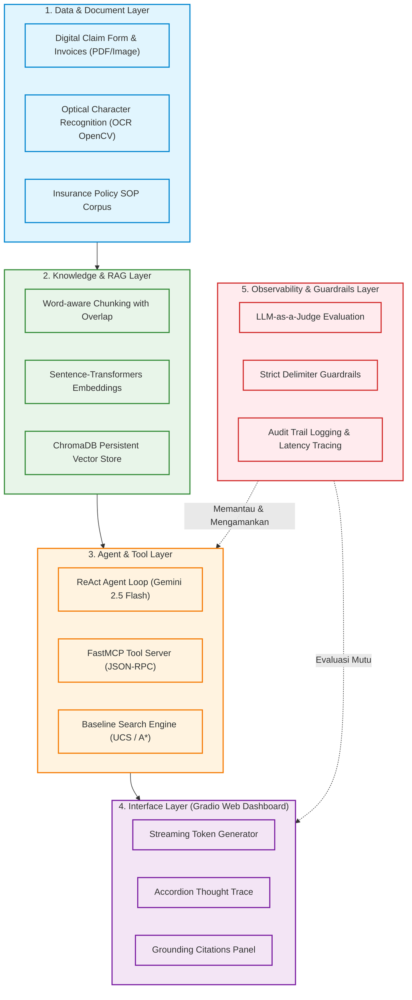

# ClaimWise AI

**Enterprise AI Copilot untuk Optimasi Alur Triase dan Verifikasi Klaim Asuransi Kesehatan Berbasis Algoritma Search (Uniform Cost Search & A* Search)**


> **Tugas 1 (Milestone 1 - W02) — Milestone Proyek Terpadu (PjBL)**  
> Mata Kuliah: 10S3001 Kecerdasan Buatan (+P) | Semester Gasal 2026/2027  
> Program Studi Sarjana Sistem Informasi — Fakultas Informatika dan Teknik Elektro, Institut Teknologi Del  
> Dosen Pengampu: Samuel Indra Gunawan Situmeang  
> Identitas Tim Pengembang: 
>                           1.AI Architect & Model Lead: Davina Olivia Yosefanny Hutabarat / 12S24047
>                           2.Data & Knowledge Engineer: Jody Alfonso Siahaan / 12S24039
>                           3.Integration & Interface Engineer: Pedro Simangunsong / 12S24011
>                           4.QA, Evaluation & Ethics Lead: Pedro Simangunsong / 12S24011


---

---

## 1. Ringkasan Eksekutif & Latar Belakang

Perusahaan asuransi kesehatan swasta berskala nasional memproses puluhan ribu klaim *reimbursement* dan *cashless* setiap bulannya. Proses verifikasi manual yang bersifat seragam (*one-size-fits-all*) menimbulkan inefisiensi sistemik:
- **Bottleneck Triase Manual:** Waktu penyelesaian rata-rata mencapai **16,8 hari kerja**, melanggar batas maksimal regulasi OJK (POJK No. 69/POJK.05/2016 maksimal 14 hari kerja).
- **Pembengkakan Biaya Operasional (Handling Cost):** Melibatkan verifikator ahli pada semua klaim tanpa stratifikasi risiko menelan biaya operasional rata-rata **Rp 145.000 per klaim**.
- **Fraud Leakage & Human Fatigue:** Beban kerja verifikator yang mencapai 60–80 berkas/hari memicu kejenuhan kognitif, memicu potensi klaim ganda, tagihan fiktif, hingga kebocoran biaya klaim sebesar **7,4%** (Rp 13,3 Miliar/tahun).

**ClaimWise AI** mengatasi masalah ini dengan memodelkan alur verifikasi sebagai **graf keputusan ruang keadaan berbobot biaya riil**. Menggunakan algoritma **Uniform Cost Search (UCS)** dan **A* Search**, sistem menentukan rute verifikasi termurah dan tercepat untuk setiap profil risiko klaim.

**ClaimWise AI** adalah purwarupa Enterprise AI Copilot yang dirancang untuk kebutuhan Inhealth, perusahaan asuransi kesehatan yang memproses puluhan ribu klaim reimbursement medis setiap bulannya. Sistem ini membantu tim verifikasi klaim melakukan triase otomatis berbasis biaya minimum, menggantikan alur verifikasi manual "one-size-fits-all" yang selama ini menyebabkan penumpukan berkas, biaya penanganan (dokter penasihat & investigator) yang membengkak, serta risiko fraud dan human error yang tinggi akibat beban kerja verifikator yang berlebihan.

Milestone 1 berfokus pada problem framing bisnis untuk konteks Inhealth, spesifikasi PEAS, dan baseline algoritma pencarian (UCS/A*) untuk merutekan klaim melalui pipeline verifikasi dengan biaya optimal.

---

## 2. Spesifikasi Arsitektur Sistem 5-Lapis

Sesuai dengan cetak biru **Enterprise AI Assistant / Copilot** Institut Teknologi Del, ClaimWise AI dirancang memenuhi arsitektur modular 5-lapis:



---

## 3. Spesifikasi Formal PEAS

| Komponen PEAS | Elemen Spesifik | Kriteria Terukur |
|---|---|---|
| **Performance Measure** | • SLA Compliance Rate<br>• Cost Efficiency<br>• Fast-Track Throughput<br>• Fraud Precision<br>• False Rejection Rate | • **≥ 98.5%** klaim tuntas dalam batas waktu SLA OJK.<br>• Reduksi rata-rata biaya penanganan klaim **≥ 40%** (dari Rp 145.000 menjadi < Rp 85.000).<br>• **≥ 60%** klaim risiko rendah selesai via *Fast-Track* (< 24 jam).<br>• Presisi deteksi indikasi kecurangan **≥ 95.0%**.<br>• **0.0%** penolakan keliru otomatis (*human audit mandatory*). |
| **Environment** | • Stakeholders & Modul Terhubung | • Portal klaim nasabah (web/mobile).<br>• SIMRS Rumah Sakit Rekanan.<br>• Basis data Core Insurance (polis, plafon, riwayat).<br>• Verifikator internal, Dokter Penasihat, Investigator Forensik.<br>• Regulasi OJK & Kemenkes. |
| **Actuators** | • Mekanisme Output & Tindakan | • Engine Dispatcher rute klaim (*FastTrack* / *StandardReview* / *FraudInvestigation*).<br>• Rekomendasi status keputusan (*Approve* / *Reject* / *Pending Info*).<br>• Pemicu pencairan dana otomatis (*Disbursement trigger*).<br>• Pengirim notifikasi multi-kanal (Email, WhatsApp API, SMS).<br>• Pencatat jejak audit (*Audit Logging System*). |
| **Sensors** | • Instrumen Persepsi Data | • Input formulir klaim terstruktur (JSON payload API).<br>• Ekstraksi berkas tagihan/kuitansi medis (OCR OpenCV).<br>• Kode diagnosis medis terstandarisasi (ICD-10 / ICD-9-CM).<br>• Status keaktifan polis & histori klaim 12 bulan terakhir. |

---

## 4. Karakteristik Lingkungan Operasional (7 Sifat Russell & Norvig)

1. **Partially Observable:** Agen tidak dapat mengamati secara langsung niat nasabah atau rekam medis masa lalu yang tidak dilampirkan; agen hanya mengamati atribut data yang diekstraksi dari berkas dan database.
2. **Multi-Agent (Competitive & Cooperative):** Agen bekerja sama secara kooperatif dengan nasabah sah dan dokter rekanan, namun bersikap kompetitif/adversarial terhadap sindikat penipuan asuransi (*fraudsters*).
3. **Stochastic (Makro Bisnis) / Deterministic (State Space):** Lingkungan bisnis riil bersifat stokastik akibat ketidakpastian dokumen. Namun, pada level penelusuran ruang keadaan, fungsi transisi dimodelkan secara deterministik untuk akurasi audit.
4. **Sequential:** Keputusan rute pada tahap intake menentukan ketersediaan opsi checkpoint berikutnya, akumulasi biaya, dan status akhir klaim.
5. **Dynamic:** Parameter polis, plafon asuransi, tarif rekanan RS, dan volume antrean klaim berubah terus-menerus saat agen beroperasi.
6. **Discrete:** Tahapan verifikasi checkpoint, himpunan aksi routing, dan metrik biaya bernilai diskret terhitung.
7. **Known:** Aturan SOP verifikasi, pasal klausul polis, dan formula pembobotan biaya operasional telah diketahui dan terdefinisi dengan pasti.

---

## 5. Formulasi Ruang Keadaan (State-Space Model: X, A, T, G, C)

Model keputusan penelusuran alur klaim dirumuskan secara formal:

- **X (State Space):** Himpunan 11 status checkpoint verifikasi:
  $$\{\text{Submitted}, \text{DocCheck}, \text{PolicyValidation}, \text{RiskScoring}, \text{FastTrack}, \text{StandardReview}, \text{MedicalReview}, \text{ApprovalOfficer}, \text{FraudInvestigation}, \text{Disbursement}, \text{Rejected}\}$$
- **A (Action Space):** Keputusan pemilihan rute verifikasi berikutnya berdasarkan hasil validasi aturan bisnis.
- **T (Transition Model):** Fungsi deterministik berarah $T(s, a) \to s'$.
- **G (Goal Test):** State tujuan di mana klaim telah memperoleh keputusan final:
  $$s \in \{\text{Disbursement}, \text{Rejected}\}$$
- **C (Path Cost):** Bobot transisi non-negatif yang menggabungkan biaya tenaga ahli dan waktu SLA:
  $$c(s, s') = \frac{\text{Biaya Staf (IDR)}}{50.000} + (\text{Estimasi SLA (Hari)} \times 0.5) \ge 1.0 > 0$$

---

## 6. Topologi Graf Triase & Justifikasi Biaya Riil

```mermaid
flowchart LR
    S(["Submitted"]):::startNode -->|c=1.0| DC["DocCheck"]
    DC -->|c=2.0| PV["PolicyValidation"]
    PV -->|c=2.0| RS{"RiskScoring"}

    RS -->|c=3.0
(Low Risk)| FT["FastTrack"]:::optimal
    RS -->|c=5.0
(Medium Risk)| SR["StandardReview"]
    RS -->|c=9.0
(High Risk)| FI["FraudInvestigation"]

    FT -->|c=1.0| D(["Disbursement"]):::goalNode
    SR -->|c=4.0| MR["MedicalReview"]
    MR -->|c=3.0| AO["ApprovalOfficer"]
    AO -->|c=1.0| D

    FI -->|c=6.0
(Legit)| AO
    FI -->|c=2.0
(Confirmed Fraud)| R(["Rejected"]):::goalNode

    classDef startNode fill:#E3F2FD,stroke:#1565C0,stroke-width:2px,stroke-dasharray: 5 5;
    classDef optimal fill:#C8E6C9,stroke:#2E7D32,stroke-width:3px;
    classDef goalNode fill:#FFF9C4,stroke:#FBC02D,stroke-width:2px;
```

### Rincian Bobot Operasional

| Edge Transisi | Biaya Staf | Estimasi SLA | Bobot ($c$) | Deskripsi Operasional |
|---|---|---|---|---|
| `Submitted` $\to$ `DocCheck` | Rp 25.000 | 4 Jam (0.17 Hari) | **1.0** | Ekstraksi OCR dan pengecekan kelengkapan formulir digital |
| `DocCheck` $\to$ `PolicyValidation` | Rp 50.000 | 8 Jam (0.33 Hari) | **2.0** | Validasi keaktifan polis, limit plafon, dan klausul masa tunggu |
| `PolicyValidation` $\to$ `RiskScoring` | Rp 50.000 | 8 Jam (0.33 Hari) | **2.0** | Penilaian skor risiko klaim berbasis analitik prediktif |
| `RiskScoring` $\to$ `FastTrack` | Rp 50.000 | 4 Jam (0.17 Hari) | **3.0** | Routing jalur cepat untuk klaim risiko rendah nominal kecil |
| `RiskScoring` $\to$ `StandardReview` | Rp 150.000 | 24 Jam (1.0 Hari) | **5.0** | Routing verifikasi standar untuk kasus tindakan medis terencana |
| `RiskScoring` $\to$ `FraudInvestigation`| Rp 350.000 | 48 Jam (2.0 Hari) | **9.0** | Routing investigasi audit mendalam akibat indikasi anomali |
| `FastTrack` $\to$ `Disbursement` | Rp 25.000 | 4 Jam (0.17 Hari) | **1.0** | Instruksi transfer pencairan dana instan ke rekening nasabah |
| `StandardReview` $\to$ `MedicalReview` | Rp 125.000 | 16 Jam (0.67 Hari) | **4.0** | Telaah kewajaran medis oleh dokter penasihat independen |
| `MedicalReview` $\to$ `ApprovalOfficer` | Rp 100.000 | 12 Jam (0.50 Hari) | **3.0** | Verifikasi akuntansi dan otorisasi batas wewenang nominal |
| `ApprovalOfficer` $\to$ `Disbursement` | Rp 25.000 | 4 Jam (0.17 Hari) | **1.0** | Eksekusi pencairan dana pasca persetujuan pejabat berwenang |
| `FraudInvestigation` $\to$ `ApprovalOfficer` | Rp 200.000 | 24 Jam (1.0 Hari) | **6.0** | Rekomendasi pencairan setelah anomali terklarifikasi sah |
| `FraudInvestigation` $\to$ `Rejected` | Rp 75.000 | 8 Jam (0.33 Hari) | **2.0** | Penerbitan surat penolakan resmi atas bukti temuan fraud |

---

## 7. Algoritma Search & Pembuktian Matematis Heuristik

Modul `ucs_search.py` mengimplementasikan dua algoritma pencarian rute:
1. **Uniform Cost Search (UCS):** Penelusuran berbasis biaya jalur terakumulasi terkecil $g(n)$ menggunakan `heapq` Min-Heap dengan tie-breaker terurut.
2. **A* Search:** Penelusuran berorientasi tujuan (*informed search*) menggunakan fungsi evaluasi $f(n) = g(n) + h(n)$.

### Nilai Estimasi Heuristik $h(n)$
- `Submitted`: 7.0 | `DocCheck`: 6.0 | `PolicyValidation`: 5.0 | `RiskScoring`: 3.0
- `FastTrack`: 1.0 | `StandardReview`: 3.0 | `MedicalReview`: 3.0 | `ApprovalOfficer`: 1.0
- `FraudInvestigation`: 1.0 | `Disbursement`: 0.0 | `Rejected`: 0.0

### Pembuktian Matematis Sifat Heuristik

1. **Admisibilitas ($h(n) \le h^*(n)$):**
   Heuristik tidak pernah melebih-lebihkan (*overestimate*) biaya riil optimal $h^*(n)$ menuju goal terdekat:
   - $h(\text{Submitted}) = 7.0 \le h^*(	ext{Submitted}) = 9.0$
   - $h(\text{DocCheck}) = 6.0 \le h^*(	ext{DocCheck}) = 8.0$
   - $h(\text{PolicyValidation}) = 5.0 \le h^*(	ext{PolicyValidation}) = 6.0$
   - $h(\text{RiskScoring}) = 3.0 \le h^*(	ext{RiskScoring}) = 4.0$
   - $h(\text{FastTrack}) = 1.0 \le h^*(	ext{FastTrack}) = 1.0$
   - $h(\text{StandardReview}) = 3.0 \le h^*(	ext{StandardReview}) = 8.0$
   - $h(\text{MedicalReview}) = 3.0 \le h^*(	ext{MedicalReview}) = 4.0$
   - $h(\text{ApprovalOfficer}) = 1.0 \le h^*(	ext{ApprovalOfficer}) = 1.0$
   - $h(\text{FraudInvestigation}) = 1.0 \le h^*(	ext{FraudInvestigation}) = 2.0$
   - $h(\text{Disbursement}) = 0.0 \le h^*(	ext{Disbursement}) = 0.0$
   - $h(\text{Rejected}) = 0.0 \le h^*(	ext{Rejected}) = 0.0$  
   $$\forall n \in X, \quad 0 \le h(n) \le h^*(n) \implies \text{Admissible}$$

2. **Konsistensi / Monotonisitas ($h(n) \le c(n, n') + h(n')$):**
   Untuk setiap edge berarah $(n, n')$, nilai estimasi $h(n)$ selalu lebih kecil atau sama dengan biaya langkah ditambah estimasi pada simpul penerus:
   - `Submitted` $\to$ `DocCheck`: $7.0 \le 1.0 + 6.0 = 7.0$ *(Terpenuhi)*
   - `DocCheck` $\to$ `PolicyValidation`: $6.0 \le 2.0 + 5.0 = 7.0$ *(Terpenuhi)*
   - `PolicyValidation` $\to$ `RiskScoring`: $5.0 \le 2.0 + 3.0 = 5.0$ *(Terpenuhi)*
   - `RiskScoring` $\to$ `FastTrack`: $3.0 \le 3.0 + 1.0 = 4.0$ *(Terpenuhi)*
   - `FastTrack` $\to$ `Disbursement`: $1.0 \le 1.0 + 0.0 = 1.0$ *(Terpenuhi)*  
   *(Seluruh 12 edge terbukti konsisten, divalidasi otomatis oleh `test_ucs_search.py`).*

### Hasil Perbandingan Kinerja

| Metrik Evaluasi | Uniform Cost Search (UCS) | A* Search (Informed) | Status |
|---|---|---|---|
| **Jalur Optimal** | `Submitted -> DocCheck -> PolicyValidation -> RiskScoring -> FastTrack -> Disbursement` | `Submitted -> DocCheck -> PolicyValidation -> RiskScoring -> FastTrack -> Disbursement` | Identik |
| **Total Biaya** | **9.00** | **9.00** | Terbukti Optimal |
| **Node Diekspansi** | 6 state | 6 state | Sempurna |
| **Peak Frontier** | 3 state | 3 state | Efisien |

---

## 8. Struktur Repositori

```text
ClaimWise-AI/
├── .gitignore                       # Pengabaian cache Python, env, dan testing
├── LICENSE                          # Lisensi resmi proyek (MIT)
├── pyproject.toml                   # Standar dependensi modern Astral uv
├── requirements.txt                 # Dependensi cadangan kompatibilitas pip
├── ucs_search.py                    # Implementasi modul pencarian (UCS & A*)
├── test_ucs_search.py               # 14 unit test otomatis pytest (100% Passed)
├── docs/
│   └── Laporan_Tugas01_ClaimWise.md  # Dokumen laporan resmi Milestone 1 (W02)
└── README.md                        # Dokumentasi komprehensif repositori
```

---

## 9. Instalasi & Panduan Reproduksi (Astral uv)

Proyek ini sepenuhnya terisolasi dan distandarisasi menggunakan manajer paket modern **[Astral uv](https://github.com/astral-sh/uv)**.

### Prasyarat
- Python `>=3.10`
- Astral `uv` terpasang (`curl -LsSf https://astral.sh/uv/install.sh | sh` atau via PowerShell / Winget)

### Langkah-Langkah Eksekusi
```bash
# 1. Clone repositori ke mesin lokal
git clone https://github.com/DavinaHutabarat/ClaimWise-AI.git
cd ClaimWise-AI

# 2. Sinkronisasi dependensi secara otomatis
uv sync

# 3. Jalankan modul pencarian rute keputusan (UCS & A* Benchmark)
uv run python ucs_search.py

# 4. Jalankan rangkaian pengujian otomatis
uv run pytest -v
```

---

## 10. Hasil Pengujian Otomatis (pytest)

Seluruh logika pencarian, struktur graf, admisibilitas heuristik, dan toleransi kasus ekstrem (*edge cases*) diuji melalui 14 pengujian otomatis:

```text
============================= test session starts =============================
platform win32 -- Python 3.11.16, pytest-9.1.1, pluggy-1.6.0
collected 14 items

test_ucs_search.py::test_finds_a_path_to_disbursement PASSED             [  7%]
test_ucs_search.py::test_picks_the_cheapest_route_not_just_any_route PASSED [ 14%]
test_ucs_search.py::test_astar_finds_identical_optimal_path PASSED       [ 21%]
test_ucs_search.py::test_compare_searches_utility PASSED                 [ 28%]
test_ucs_search.py::test_heuristic_is_admissible PASSED                  [ 35%]
test_ucs_search.py::test_heuristic_is_consistent_monotonic PASSED        [ 42%]
test_ucs_search.py::test_heuristic_goal_states_are_zero PASSED           [ 50%]
test_ucs_search.py::test_all_edge_weights_are_strictly_positive PASSED   [ 57%]
test_ucs_search.py::test_goal_state_has_no_outgoing_edges PASSED         [ 64%]
test_ucs_search.py::test_cost_breakdown_matches_graph_weights PASSED     [ 71%]
test_ucs_search.py::test_unreachable_goal_returns_none PASSED            [ 78%]
test_ucs_search.py::test_target_specific_fraud_rejection PASSED          [ 85%]
test_ucs_search.py::test_cycle_resistance_explored_set PASSED            [ 92%]
test_ucs_search.py::test_negative_edge_weight_raises_error PASSED        [100%]

============================== 14 passed in 0.03s ==============================
```

---

## 11. Distribusi Peran Tim (PjBL)

Berdasarkan Panduan Proyek Akhir Terpadu Sarjana Sistem Informasi IT Del, peran dan tanggung jawab profesional tim terdistribusi secara seimbang:

| Nama Mahasiswa | Peran Enterprise AI | Tanggung Jawab & Kontribusi Teknis |
|---|---|---|
| **Davina Olivia Yosefanny Hutabarat** | **QA, Evaluation & Ethics Lead** | • Perancangan dan implementasi 14 skenario unit test `pytest`.<br>• Validasi sifat admisibilitas & konsistensi heuristik.<br>• Audit etika AI, transparansi keputusan, dan kepatuhan UU PDP No. 27/2022.<br>• Manajemen rilis repositori dan integrasi laporan W02. |
| **Jodi** | **AI Architect & Model Lead** | • Formulasi formal ruang keadaan $(X, A, T, G, C)$.<br>• Desain fungsi heuristik batas bawah optimistik $h(n)$.<br>• Implementasi algoritma UCS dan A* Search berbasis `heapq` (`ucs_search.py`).<br>• Analisis kompleksitas waktu $O(b^{C^*/\epsilon})$ dan ruang $O(b^d)$. |
| **Pedro Simangunsong** | **Integration & Interface Engineer** | • Konfigurasi dan standarisasi Astral `uv` (`pyproject.toml`, `requirements.txt`).<br>• Penyusunan dokumentasi komprehensif `README.md` dan diagram arsitektur Mermaid.<br>• Manajemen lisensi, sanitasi `.gitignore`, dan pemeliharaan branch Git. |

---

## 12. Kepatuhan Etika AI & Tata Kelola Data

1. **Kepatuhan UU Perlindungan Data Pribadi (UU PDP No. 27/2022):**  
   Data klaim kesehatan diklasifikasikan sebagai *Data Pribadi Spesifik*. Sistem menegakkan prinsip minimisasi data (*data minimization*), enkripsi saat transit, dan memastikan data medis tidak diekspos keluar dari batas komputasi aman.
2. **Pedoman Etika Kecerdasan Artifisial (SE Menkominfo No. 9/2023):**  
   - **Prinsip Akuntabilitas:** Seluruh alur keputusan routing dapat diaudit kembali melalui *audit trail logging*.
   - **Human-in-the-Loop:** Sistem berfungsi sebagai *Decision-Support Assistant*; keputusan akhir penolakan klaim (`Rejected`) wajib melalui validasi dan verifikasi petugas verifikator manusia (*Approval Officer*).
   - **Non-Diskriminasi:** Penetapan alur klaim murni didasarkan pada objektivitas parameter klinis dan klausul polis, tanpa diskriminasi latar belakang nasabah.

---

## 13. Lisensi

Proyek ini dilisensikan di bawah ketentuan lisensi terbuka **[MIT License](./LICENSE)**.
