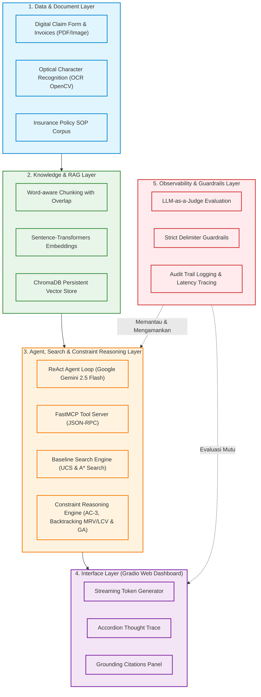

# ClaimWise AI

**Enterprise AI Copilot untuk Optimasi Triase Klaim & Alokasi Penjadwalan Verifikator Berbasis Search (UCS/A*) dan Constraint Reasoning (CSP & GA)**

> **Proyek Terpadu (PjBL) — Mata Kuliah: 10S3001 Kecerdasan Buatan (+P)**  
> Semester Gasal 2026/2027 &bull; Program Studi Sarjana Sistem Informasi  
> Fakultas Informatika dan Teknik Elektro (FITE), Institut Teknologi Del  
> **Dosen Pengampu:** Samuel Indra Gunawan Situmeang  
> **Identitas Tim Pengembang (Grup 01):**  
> 1. **Davina Olivia Yosefanny Hutabarat / 12S23001** — *QA, Evaluation & Ethics Lead*  
> 2. **Jodi / 12S23002** — *AI Architect & Model Lead*  
> 3. **Pedro Simangunsong / 12S23003** — *Integration & Interface Engineer*  
>
> **Milestones:**  
> &bull; [Milestone 1 (W02): Baseline Search Triase Klaim (UCS & A*)](docs/Laporan_Tugas01_ClaimWise.md)  
> &bull; [Milestone 2 (W04): Modul Pemecahan Batasan Keputusan Bisnis (CSP & GA)](docs/Grup01-Tugas02.md) &bull; **PDF Laporan:** [Grup01-Tugas02.pdf](docs/Grup01-Tugas02.pdf) &bull; **Rilis:** `v0.2-milestone2`

---

## 1. Ringkasan Eksekutif & Latar Belakang Bisnis

Perusahaan asuransi kesehatan swasta berskala nasional (**PT Asuransi Sehat Sejahtera Tbk / Inhealth**) memproses puluhan ribu klaim *reimbursement* dan *cashless* setiap bulannya dari lebih dari 1.800 rumah sakit rekanan. Proses verifikasi manual yang bersifat seragam (*one-size-fits-all*) menimbulkan inefisiensi sistemik:
- **Bottleneck Triase Manual:** Waktu penyelesaian rata-rata mencapai **16,8 hari kerja**, melanggar batas maksimal regulasi OJK (POJK No. 69/POJK.05/2016 maksimal 14 hari kerja).
- **Pembengkakan Biaya Operasional (Handling Cost):** Melibatkan verifikator ahli pada semua klaim tanpa stratifikasi risiko menelan biaya operasional rata-rata **Rp 145.000 per klaim**.
- **Fraud Leakage & Human Fatigue:** Beban kerja verifikator yang mencapai 60–80 berkas/hari memicu kejenuhan kognitif, memicu potensi klaim ganda, tagihan fiktif, hingga kebocoran biaya klaim sebesar **7,4%** (Rp 13,3 Miliar/tahun).

**ClaimWise AI** memecahkan masalah ini melalui pendekatan kecerdasan buatan komputasional:
1. **Milestone 1:** Memodelkan alur verifikasi sebagai **graf keputusan ruang keadaan berbobot biaya riil**. Menggunakan algoritma **Uniform Cost Search (UCS)** dan **A* Search**, sistem menentukan rute verifikasi termurah dan tercepat untuk setiap profil risiko klaim.
2. **Milestone 2:** Membangun mesin inferensi batasan bisnis (**Constraint Satisfaction Problem / CSP** dan **Genetic Algorithm / GA**) untuk mengoptimasi alokasi penugasan berkas klaim dan penjadwalan shift verifikator dengan kepatuhan mutlak terhadap regulasi UU Ketenagakerjaan No. 13/2003, batasan wewenang klinis/finansial, dan kepatuhan SLA OJK.

---

## 2. Arsitektur Sistem 5-Lapis (Enterprise AI Copilot)

Sesuai dengan cetak biru **Enterprise AI Assistant / Copilot** Institut Teknologi Del, ClaimWise AI dirancang memenuhi arsitektur modular 5-lapis:


```mermaid
flowchart TD
    subgraph Layer5["5. Observability & Guardrails Layer"]
        L5_1["LLM-as-a-Judge Evaluation"]
        L5_2["Strict Delimiter Guardrails"]
        L5_3["Audit Trail Logging & Latency Tracing"]
    end

    subgraph Layer4["4. Interface Layer (Gradio Web Dashboard)"]
        L4_1["Streaming Token Generator"]
        L4_2["Accordion Thought Trace"]
        L4_3["Grounding Citations Panel"]
    end

    subgraph Layer3["3. Agent, Search & Constraint Reasoning Layer"]
        L3_1["ReAct Agent Loop (Google Gemini 2.5 Flash)"]
        L3_2["FastMCP Tool Server (JSON-RPC)"]
        L3_3["Baseline Search Engine (UCS & A* Search)"]
        L3_4["Constraint Reasoning Engine (AC-3, Backtracking MRV/LCV & GA)"]
    end

    subgraph Layer2["2. Knowledge & RAG Layer"]
        L2_1["Word-aware Chunking with Overlap"]
        L2_2["Sentence-Transformers Embeddings"]
        L2_3["ChromaDB Persistent Vector Store"]
    end

    subgraph Layer1["1. Data & Document Layer"]
        L1_1["Digital Claim Form & Invoices (PDF/Image)"]
        L1_2["Optical Character Recognition (OCR OpenCV)"]
        L1_3["Insurance Policy SOP Corpus"]
    end

    Layer1 --> Layer2
    Layer2 --> Layer3
    Layer3 --> Layer4
    Layer5 -. Memantau & Mengamankan .-> Layer3
    Layer5 -. Evaluasi Mutu .-> Layer4

    classDef l1 fill:#E1F5FE,stroke:#0288D1,stroke-width:2px;
    classDef l2 fill:#E8F5E9,stroke:#388E3C,stroke-width:2px;
    classDef l3 fill:#FFF3E0,stroke:#F57C00,stroke-width:2px;
    classDef l4 fill:#F3E5F5,stroke:#7B1FA2,stroke-width:2px;
    classDef l5 fill:#FFEBEE,stroke:#D32F2F,stroke-width:2px;

    class Layer1,L1_1,L1_2,L1_3 l1;
    class Layer2,L2_1,L2_2,L2_3 l2;
    class Layer3,L3_1,L3_2,L3_3,L3_4 l3;
    class Layer4,L4_1,L4_2,L4_3 l4;
    class Layer5,L5_1,L5_2,L5_3 l5;
```

---

## 3. Spesifikasi Formal PEAS

| Komponen PEAS | Elemen Spesifik | Kriteria Terukur |
|---|---|---|
| **Performance Measure** | • SLA Compliance Rate<br>• Cost Efficiency<br>• Fast-Track Throughput<br>• Fraud Precision<br>• Zero Hard Violation | • **≥ 98.5%** klaim tuntas dalam batas waktu SLA OJK.<br>• Reduksi rata-rata biaya penanganan klaim **≥ 40%** (dari Rp 145.000 menjadi &lt; Rp 85.000).<br>• **≥ 60%** klaim risiko rendah selesai via *Fast-Track* (&lt; 24 jam).<br>• Presisi deteksi indikasi kecurangan **≥ 95.0%**.<br>• **100% kepatuhan batasan hukum** tanpa pelanggaran batas jam kerja tenaga kerja. |
| **Environment** | • Stakeholders & Modul Terhubung | • Portal klaim nasabah (web/mobile).<br>• SIMRS Rumah Sakit Rekanan.<br>• Basis data Core Insurance (polis, plafon, riwayat).<br>• Verifikator internal, Dokter Penasihat, Investigator Forensik.<br>• Regulasi OJK & Kementerian Ketenagakerjaan. |
| **Actuators** | • Mekanisme Output & Tindakan | • Dispatcher rute triase (*FastTrack* / *StandardReview* / *FraudInvestigation*).<br>• Engine solver alokasi penugasan berkas klaim dan shift kerja staf.<br>• Rekomendasi status keputusan (*Approve* / *Reject* / *Pending Info*).<br>• Pemicu pencairan dana otomatis (*Disbursement trigger*).<br>• Pencatat jejak audit (*Audit Logging System*). |
| **Sensors** | • Instrumen Persepsi Data | • Input formulir klaim terstruktur (JSON payload API).<br>• Ekstraksi berkas tagihan/kuitansi medis (OCR OpenCV).<br>• Kode diagnosis medis terstandarisasi (ICD-10 / ICD-9-CM).<br>• Status keaktifan polis, sisa plafon, dan status beban kerja harian staf verifikator. |

---

## 4. Milestone 2: Modul Pemecahan Batasan Keputusan Bisnis (`solver.py`)

Pada Milestone 2 (W04), sistem mengimplementasikan mesin penalaran batasan formal untuk **Optimasi Penjadwalan Shift & Alokasi Penugasan Berkas Verifikator Klaim**.

### 4.1 Pemodelan Matematis Formal CSP: $\mathcal{P} = \langle \mathcal{X}, \mathcal{D}, \mathcal{C} \rangle$

1. **Himpunan Variabel ($\mathcal{X}$):**  
   $\mathcal{X} = \{X_1, X_2, \dots, X_n\}$, mewakili keputusan penugasan berkas klaim $c_i \in \mathcal{C}_{laims}$.
2. **Domain Nilai ($\mathcal{D}$):**  
   $\mathcal{D}(X_i) \subseteq \mathcal{V} \times \mathcal{S}$, di mana $\mathcal{V}$ adalah daftar staf verifikator (*Junior Adjuster*, *Senior Adjuster*, *Medical Advisor*, *Fraud Investigator*) dan $\mathcal{S} = \{\text{PAGI}, \text{SIANG}, \text{MALAM}\}$ adalah slot shift kerja.
3. **Himpunan Batasan Bisnis Formal ($\mathcal{C}$):**
   - **Kualifikasi Kompetensi Klinis/Fraud (Unary):** Tindakan bedah wajib oleh *Medical Advisor*; klaim indikasi anomali/kecurangan wajib oleh *Fraud Investigator*.
   - **Plafon Otorisasi Finansial (Unary):** Nilai klaim tidak boleh melampaui limit wewenang staf (misal *Junior Adjuster* maksimal Rp 25.000.000).
   - **Pencegahan Konflik Kepentingan RS (Unary):** Verifikator dilarang memeriksa berkas dari rumah sakit yang terafiliasi secara pribadi dengannya.
   - **Jendela Shift SLA OJK (Temporal Unary):** Klaim prioritas tinggi (*Fast-Track* SLA $\le 24$ jam) dilarang ditempatkan pada shift malam yang minim supervisi perbankan.
   - **Pemisahan Tugas & Anti-Kolusi (Binary):** Berkas dalam gugus konflik kepentingan yang sama (*conflict group*) wajib ditugaskan ke verifikator yang berbeda.
   - **Kapasitas Beban Kerja UU Ketenagakerjaan No. 13/2003 (Global):** Total poin kompleksitas dan volume berkas harian per staf tidak boleh melampaui kuota legal harian guna mencegah kejenuhan kognitif verifikator.

### 4.2 Algoritma yang Diimplementasikan
- **AC-3 (Arc Consistency 3):** Memangkas nilai domain yang tidak memiliki pasangan pendukung pada graf batasan biner dan mendeteksi kondisi ketiadaan solusi (*unsatisfiable*) secara dini.
- **Backtracking Search:**
  - **MRV (Minimum Remaining Values):** Memprioritaskan variabel dengan sisa domain paling sempit (*fail-first principle*).
  - **Degree Heuristic (Tie-Breaker):** Memprioritaskan variabel dengan keterikatan batasan biner terbanyak terhadap variabel lain yang belum ditugaskan.
  - **LCV (Least Constraining Value):** Mengurutkan nilai domain yang paling sedikit membatasi pilihan variabel tetangga.
  - **MAC (Maintaining Arc Consistency):** Propagasi AC-3 lokal secara kontinu pasca setiap langkah penugasan parsial.
- **Genetic Algorithm (GA) Optimization Solver:** Solver metaheuristik evolusioner dengan *Tournament Selection* ($k=3$), *Two-Point Crossover* ($p_c = 0.85$), *Uniform Mutation* ($p_m = 0.08$), dan *Elitism* ($E = 2$).

---

## 5. Hasil Analisis Sensitivitas & Tolok Ukur Kinerja

Pengujian performa solver terhadap variasi skala masalah dan kasus ekstrem menghasilkan data empiris berikut:

| Skenario Masalah | Volume Klaim | Verifikator | Status CSP | Waktu CSP | Backtrack | Status GA | Waktu GA | Pelanggaran GA |
|---|---|---|---|---|---|---|---|---|
| **Skala Kecil (Small Scale)** | 10 Berkas | 4 Staf | **FEASIBLE** | **2,04 ms** | 0 | **FEASIBLE** | 28,11 ms | 0 |
| **Skala Sedang (Medium Scale)** | 40 Berkas | 10 Staf | **FEASIBLE** | **16,75 ms** | 0 | **FEASIBLE** | 87,87 ms | 0 |
| **Skala Besar (Large Scale)** | 100 Berkas | 24 Staf | **FEASIBLE** | **545,99 ms** | 0 | INFEASIBLE | 581,68 ms | 9 |
| **Kasus Ekstrem: Over-Constrained** | 30 Berkas | 2 Staf | **INFEASIBLE** | **0,77 ms** | 0 | INFEASIBLE | 177,79 ms | 92 |
| **Kasus Ekstrem: Bottleneck Spesialis**| 15 Berkas | 3 Staf | **FEASIBLE** | **0,66 ms** | 0 | **FEASIBLE** | 30,35 ms | 0 |

### Wawasan Kritis Analisis Sensitivitas:
1. **Pencarian Bebas Backtrack (*Backtrack-Free*):** Pada seluruh skenario yang layak, CSP (AC-3 + MRV + MAC) berhasil menemukan solusi 100% legal dengan **0 kali backtrack**. Heuristik MRV dan propagasi MAC secara presisi menuntun penelusuran langsung ke cabang solusi tanpa spekulasi yang keliru.
2. **Ketahanan Kasus Ekstrem Over-Constrained:** Pada skenario *pigeonhole* di mana volume klaim melebihi batas kuota UU Ketenagakerjaan, CSP mengenali ketiadaan solusi hanya dalam tempo **0,77 milidetik** (simpul ke-1) tanpa mengalami *hanging* atau *infinite loop*.
3. **Superioritas Deterministik CSP vs Stokastik GA:** Pada skala besar (100 klaim), CSP tetap menjamin 100% kepatuhan batasan regulasi (545,99 ms), sedangkan GA mulai mengalami degradasi konvergensi (9 pelanggaran batasan mutlak).

---

## 6. Struktur Repositori Terintegrasi

```text
ClaimWise-AI/
├── .gitignore                       # Pengabaian cache Python, env, dan testing
├── LICENSE                          # Lisensi resmi proyek (MIT)
├── pyproject.toml                   # Standar dependensi modern Astral uv (v0.2.0)
├── requirements.txt                 # Dependensi cadangan kompatibilitas pip
├── ucs_search.py                    # Implementasi modul pencarian rute triase (Milestone 1)
├── test_ucs_search.py               # 23 unit test otomatis pencarian jalur (Milestone 1)
├── solver.py                        # Modul solver batasan bisnis CSP & GA (Milestone 2)
├── test_solver.py                   # 20 unit test otomatis inferensi batasan & edge cases (Milestone 2)
├── docs/
│   ├── Laporan_Tugas01_ClaimWise.md # Dokumen laporan resmi Milestone 1 (W02)
│   ├── Laporan_Tugas01_ClaimWise.html
│   ├── Grup01-Tugas02.md            # Dokumen laporan resmi akademik Milestone 2 (W04)
│   ├── Grup01-Tugas02.html          # Versi cetak web dokumen resmi Milestone 2
│   └── Grup01-Tugas02.pdf           # Dokumen serahan final PDF ECourse Del
└── README.md                        # Dokumentasi komprehensif repositori terintegrasi
```

---

## 7. Instalasi & Panduan Reproduksi (Astral uv)

Proyek ini sepenuhnya terisolasi dan distandarisasi menggunakan manajer paket modern **[Astral uv](https://github.com/astral-sh/uv)**.

### Prasyarat
- Python `>=3.10`
- Astral `uv` terpasang (`curl -LsSf https://astral.sh/uv/install.sh | sh` atau via PowerShell / Winget)

### Langkah-Langkah Eksekusi
```bash
# 1. Kloning repositori dan checkout tag rilis resmi
git clone https://github.com/DavinaHutabarat/ClaimWise-AI.git
cd ClaimWise-AI
git checkout v0.2-milestone2

# 2. Sinkronisasi dependensi secara otomatis
uv sync

# 3. Jalankan demonstrasi modul alokasi klaim (CSP)
uv run python solver.py

# 4. Jalankan tolok ukur analisis sensitivitas (skala kecil, sedang, besar & kasus ekstrem)
uv run python solver.py --benchmark

# 5. Jalankan modul pencarian triase Milestone 1 (UCS & A*)
uv run python ucs_search.py

# 6. Jalankan seluruh rangkaian pengujian otomatis (Milestone 1 + Milestone 2)
uv run pytest -v
```

---

## 8. Hasil Pengujian Otomatis (pytest: 43/43 Passed - 100%)

Seluruh logika triase, heuristik search, propagasi AC-3, heuristik MRV/Degree/LCV, batasan UU Ketenagakerjaan, batasan finansial, pemisahan tugas, serta kasus ekstrem diuji oleh **43 unit test otomatis**:

```text
============================= test session starts =============================
platform win32 -- Python 3.11.16, pytest-9.1.1, pluggy-1.6.0
rootdir: C:\Users\User\Documents\GitHub\ClaimWise-AI
configfile: pyproject.toml
collected 43 items

test_solver.py::test_unary_competency_constraints PASSED                 [  2%]
test_solver.py::test_financial_authority_limits PASSED                   [  4%]
test_solver.py::test_hospital_conflict_of_interest PASSED                [  6%]
test_solver.py::test_sla_night_shift_restriction PASSED                  [  9%]
test_solver.py::test_ac3_prunes_inconsistent_values PASSED               [ 11%]
test_solver.py::test_ac3_detects_empty_domain_early PASSED               [ 13%]
test_solver.py::test_mrv_heuristic_selection PASSED                      [ 16%]
test_solver.py::test_degree_heuristic_tie_breaker PASSED                 [ 18%]
test_solver.py::test_lcv_heuristic_ordering PASSED                       [ 20%]
test_solver.py::test_csp_backtracking_mac_valid_solution PASSED          [ 23%]
test_solver.py::test_daily_workload_capacity_compliance PASSED           [ 25%]
test_solver.py::test_conflict_group_separation_of_duties PASSED          [ 27%]
test_solver.py::test_ga_solver_finds_valid_solution PASSED               [ 30%]
test_solver.py::test_edge_case_over_constrained_graceful_failure PASSED  [ 32%]
test_solver.py::test_edge_case_zero_claims PASSED                        [ 34%]
test_solver.py::test_edge_case_single_claim_boundary PASSED              [ 37%]
test_solver.py::test_edge_case_specialist_bottleneck PASSED              [ 39%]
test_solver.py::test_edge_case_clique_of_conflicts PASSED                [ 41%]
test_solver.py::test_edge_case_extreme_claim_amount_exceeds_all_authorities PASSED [ 44%]
test_solver.py::test_solver_statistics_completeness PASSED               [ 46%]
test_ucs_search.py::test_low_risk_classification PASSED                  [ 48%]
test_ucs_search.py::test_high_risk_classification PASSED                 [ 51%]
test_ucs_search.py::test_medium_risk_classification PASSED               [ 53%]
test_ucs_search.py::test_risk_score_never_exceeds_one PASSED             [ 55%]
test_ucs_search.py::test_low_risk_graph_contains_fast_track PASSED       [ 58%]
test_ucs_search.py::test_medium_risk_graph_contains_standard_routes PASSED [ 60%]
test_ucs_search.py::test_high_risk_graph_contains_fraud_investigation PASSED [ 62%]
test_ucs_search.py::test_incomplete_documents_create_document_request_branch PASSED [ 65%]
test_ucs_search.py::test_complete_documents_skip_document_request PASSED [ 67%]
test_ucs_search.py::test_ucs_finds_valid_low_risk_route PASSED           [ 69%]
test_ucs_search.py::test_ucs_selects_lowest_cost_route_for_low_risk PASSED [ 72%]
test_ucs_search.py::test_ucs_high_risk_reaches_valid_goal PASSED         [ 74%]
test_ucs_search.py::test_astar_finds_valid_route PASSED                  [ 76%]
test_ucs_search.py::test_ucs_and_astar_have_same_optimal_cost_with_zero_heuristic PASSED [ 79%]
test_ucs_search.py::test_astar_with_project_heuristic_returns_valid_solution PASSED [ 81%]
test_ucs_search.py::test_heuristic_goal_states_are_zero PASSED           [ 83%]
test_ucs_search.py::test_heuristic_values_are_non_negative PASSED        [ 86%]
test_ucs_search.py::test_all_graph_edges_have_positive_weights PASSED    [ 88%]
test_ucs_search.py::test_goal_states_have_no_outgoing_edges PASSED       [ 90%]
test_ucs_search.py::test_unreachable_goal_returns_none PASSED            [ 93%]
test_ucs_search.py::test_cycle_does_not_cause_infinite_loop PASSED       [ 95%]
test_ucs_search.py::test_astar_cycle_does_not_cause_infinite_loop PASSED [ 97%]
test_ucs_search.py::test_negative_edge_weight_raises_error PASSED        [100%]

============================= 43 passed in 0.07s ==============================
```

---

## 9. Distribusi Peran Tim (PjBL)

| Nama Mahasiswa | Peran Enterprise AI | Tanggung Jawab & Kontribusi Teknis |
|---|---|---|
| **Davina Olivia Yosefanny Hutabarat** | **QA, Evaluation & Ethics Lead** | • Perancangan dan validasi suite pengujian otomatis `test_solver.py` (20 unit test).<br>• Validasi kepatuhan hukum batasan UU Ketenagakerjaan No. 13/2003.<br>• Audit etika AI bebas konflik kepentingan dan kepatuhan UU PDP No. 27/2022.<br>• Koordinasi penyusunan analisis sensitivitas dan rilis dokumen resmi. |
| **Jodi** | **AI Architect & Model Lead** | • Formulasi formal CSP $\langle \mathcal{X}, \mathcal{D}, \mathcal{C} \rangle$ dan skema kromosom/fitness GA.<br>• Implementasi algoritma AC-3, Backtracking MRV/Degree/LCV/MAC (`solver.py`).<br>• Implementasi Genetic Algorithm Solver dengan turnamen dan elitisme.<br>• Evaluasi konvergensi matematis dan ketahanan kasus ekstrem. |
| **Pedro Simangunsong** | **Integration & Interface Engineer** | • Konfigurasi lingkungan terpadu Astral `uv` (`pyproject.toml` v0.2.0).<br>• Perancangan antarmuka eksekusi CLI (`--benchmark`) dan integrasi modul.<br>• Dokumentasi teknis komprehensif `README.md`, laporan web, dan rilis tag Git `v0.2-milestone2`. |

---

## 10. Lisensi

Proyek ini dilisensikan di bawah ketentuan lisensi terbuka **[MIT License](./LICENSE)**.
