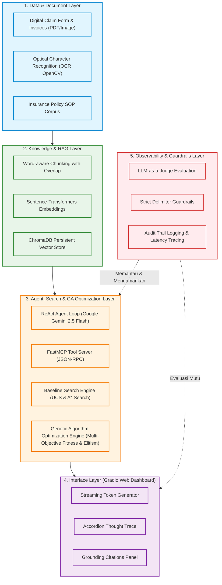

# ClaimWise AI

**Enterprise AI Copilot untuk Optimasi Triase Klaim & Alokasi Penjadwalan Verifikator Berbasis Algoritma Search (UCS/A*) dan Algoritma Genetika Multi-Objektif (GA Optimization)**

> **Proyek Terpadu (PjBL) — Mata Kuliah: 10S3001 Kecerdasan Buatan (+P)**  
> Semester Gasal 2026/2027 &bull; Program Studi Sarjana Sistem Informasi  
> Fakultas Informatika dan Teknik Elektro (FITE), Institut Teknologi Del  
> **Dosen Pengampu:** Samuel Indra Gunawan Situmeang  
> **Identitas Tim Pengembang (Grup 08):**  
> 1. **Davina Olivia Yosefanny Hutabarat / 12S24047** — *AI Architecture & Model Lead*  
> 2. **Pedro Simangunsong / 12S24011** — *Integration & Interface Engineer + QA, Evaluation & Ethics Lead*  
> 3. **Jody Alfonso Siahaan / 12S24039** — *Data & Knowledge Engineer*  
>
>

---

## 1. Ringkasan Eksekutif & Latar Belakang Bisnis

Perusahaan asuransi kesehatan swasta berskala nasional (**PT Asuransi Sehat Sejahtera Tbk / Inhealth**) memproses puluhan ribu klaim *reimbursement* dan *cashless* setiap bulannya dari lebih dari 1.800 rumah sakit rekanan. Proses verifikasi manual yang bersifat seragam (*one-size-fits-all*) menimbulkan inefisiensi sistemik:
- **Bottleneck Triase Manual:** Waktu penyelesaian rata-rata mencapai **16,8 hari kerja**, melanggar batas maksimal regulasi OJK (POJK No. 69/POJK.05/2016 maksimal 14 hari kerja).
- **Pembengkakan Biaya Operasional (Handling Cost):** Melibatkan verifikator ahli pada semua klaim tanpa stratifikasi risiko menelan biaya operasional rata-rata **Rp 145.000 per klaim**.
- **Fraud Leakage & Human Fatigue:** Beban kerja verifikator yang mencapai 60–80 berkas/hari memicu kejenuhan kognitif, memicu potensi klaim ganda, tagihan fiktif, hingga kebocoran biaya klaim sebesar **7,4%** (Rp 13,3 Miliar/tahun).

**ClaimWise AI** memecahkan masalah ini melalui pendekatan kecerdasan buatan komputasional:
1. **Milestone 1:** Memodelkan alur verifikasi sebagai **graf keputusan ruang keadaan berbobot biaya riil**. Menggunakan algoritma **Uniform Cost Search (UCS)** dan **A* Search**, sistem menentukan rute verifikasi termurah dan tercepat untuk setiap profil risiko klaim.
2. **Milestone 2:** Mengembangkan mesin optimasi kombinatorik berbasis **Algoritma Genetika (Genetic Algorithm - GA)** untuk memecahkan trade-off multi-objektif antara biaya operasional staf, durasi SLA, risiko kebocoran fraud, dan keadilan beban kerja harian staf dengan penegakan batasan hukum ketat (**UU Ketenagakerjaan No. 13/2003** dan regulasi OJK).

---

## 2. Arsitektur Sistem 5-Lapis (Enterprise AI Copilot)

Sesuai dengan cetak biru **Enterprise AI Assistant / Copilot** Institut Teknologi Del, ClaimWise AI dirancang memenuhi arsitektur modular 5-lapis:


```mermaid
flowchart TD
    subgraph Layer5["5. Observability & Guardrails Layer"]
        L5_1["LLM-as-a-Judge Evaluation"]
        L5_2["Strict Delimiter Guardrails"]
        L5_3["Audit Trail Logging & Latency Tracing"]
    end

    subgraph Layer4["4. Interface Layer (Gradio Web Dashboard)"]
        L4_1["Streaming Token Generator"]
        L4_2["Accordion Thought Trace"]
        L4_3["Grounding Citations Panel"]
    end

    subgraph Layer3["3. Agent, Search & GA Optimization Layer"]
        L3_1["ReAct Agent Loop (Google Gemini 2.5 Flash)"]
        L3_2["FastMCP Tool Server (JSON-RPC)"]
        L3_3["Baseline Search Engine (UCS & A* Search)"]
        L3_4["Genetic Algorithm Optimization Engine (Multi-Objective Fitness & Elitism)"]
    end

    subgraph Layer2["2. Knowledge & RAG Layer"]
        L2_1["Word-aware Chunking with Overlap"]
        L2_2["Sentence-Transformers Embeddings"]
        L2_3["ChromaDB Persistent Vector Store"]
    end

    subgraph Layer1["1. Data & Document Layer"]
        L1_1["Digital Claim Form & Invoices (PDF/Image)"]
        L1_2["Optical Character Recognition (OCR OpenCV)"]
        L1_3["Insurance Policy SOP Corpus"]
    end

    Layer1 --> Layer2
    Layer2 --> Layer3
    Layer3 --> Layer4
    Layer5 -. Memantau & Mengamankan .-> Layer3
    Layer5 -. Evaluasi Mutu .-> Layer4

    classDef l1 fill:#E1F5FE,stroke:#0288D1,stroke-width:2px;
    classDef l2 fill:#E8F5E9,stroke:#388E3C,stroke-width:2px;
    classDef l3 fill:#FFF3E0,stroke:#F57C00,stroke-width:2px;
    classDef l4 fill:#F3E5F5,stroke:#7B1FA2,stroke-width:2px;
    classDef l5 fill:#FFEBEE,stroke:#D32F2F,stroke-width:2px;

    class Layer1,L1_1,L1_2,L1_3 l1;
    class Layer2,L2_1,L2_2,L2_3 l2;
    class Layer3,L3_1,L3_2,L3_3,L3_4 l3;
    class Layer4,L4_1,L4_2,L4_3 l4;
    class Layer5,L5_1,L5_2,L5_3 l5;
```

---

## 3. Spesifikasi Formal PEAS

| Komponen PEAS | Elemen Spesifik | Kriteria Terukur |
|---|---|---|
| **Performance Measure** | • SLA Compliance Rate<br>• Cost Efficiency<br>• Fast-Track Throughput<br>• Fraud Precision<br>• Zero Hard Violation | • **≥ 98.5%** klaim tuntas dalam batas waktu SLA OJK.<br>• Reduksi rata-rata biaya penanganan klaim **≥ 40%** (dari Rp 145.000 menjadi &lt; Rp 85.000).<br>• **≥ 60%** klaim risiko rendah selesai via *Fast-Track* (&lt; 24 jam).<br>• Presisi deteksi indikasi kecurangan **≥ 95.0%**.<br>• **100% kepatuhan batasan hukum** tanpa pelanggaran batas jam kerja tenaga kerja. |
| **Environment** | • Stakeholders & Modul Terhubung | • Portal klaim nasabah (web/mobile).<br>• SIMRS Rumah Sakit Rekanan.<br>• Basis data Core Insurance (polis, plafon, riwayat).<br>• Verifikator internal, Dokter Penasihat, Investigator Forensik.<br>• Regulasi OJK & Kementerian Ketenagakerjaan. |
| **Actuators** | • Mekanisme Output & Tindakan | • Dispatcher rute triase (*FastTrack* / *StandardReview* / *FraudInvestigation*).<br>• Engine solver alokasi penugasan berkas klaim dan shift kerja staf berbasis GA.<br>• Rekomendasi status keputusan (*Approve* / *Reject* / *Pending Info*).<br>• Pemicu pencairan dana otomatis (*Disbursement trigger*).<br>• Pencatat jejak audit (*Audit Logging System*). |
| **Sensors** | • Instrumen Persepsi Data | • Input formulir klaim terstruktur (JSON payload API).<br>• Ekstraksi berkas tagihan/kuitansi medis (OCR OpenCV).<br>• Kode diagnosis medis terstandarisasi (ICD-10 / ICD-9-CM).<br>• Status keaktifan polis, sisa plafon, dan status beban kerja harian staf verifikator. |

---

## 4. Milestone 2: Modul Optimasi Algoritma Genetika (`solver.py`)

Pada Milestone 2 (W04), sistem mengimplementasikan mesin optimasi komputasional cerdas berbasis **Algoritma Genetika (Genetic Algorithm - GA)** untuk memecahkan trade-off alokasi penugasan klaim asuransi.

### 4.1 Pemodelan Matematis Formal GA

1. **Skema Representasi Kromosom:**  
   Setiap individu merepresentasikan satu solusi alokasi harian ke dalam vektor integer:
   $$\mathbf{g} = \langle g_1, g_2, \dots, g_N \rangle, \quad g_i \in \{0, 1, \dots, K-1\}$$
   Setiap gen $g_i$ memetakan klaim $c_i$ ke salah satu pasangan $(\text{verifier}_j, \text{shift}_k)$ dari total $K$ kombinasi staf dan shift (PAGI, SIANG, MALAM).

2. **Formulasi Fungsi Kebugaran Multi-Objektif & Sistem Penalti Bertingkat:**
   $$f(\mathbf{g}) = \frac{10^6}{1.0 + \text{Penalty}_{\text{total}}(\mathbf{g}) + \text{Term}_{\text{cost}}(\mathbf{g}) + \text{Term}_{\text{balance}}(\mathbf{g}) + \text{Term}_{\text{fraud}}(\mathbf{g})}$$

   - **Sistem Penalti Regulasi Mutlak ($\text{Penalty}_{\text{total}}$):**
     * **Kualifikasi Dokter/Fraud ($\lambda = 25.000$):** Klaim bedah wajib oleh dokter penasihat (*Medical Advisor*); klaim anomali wajib oleh investigator forensik (*Fraud Investigator*).
     * **Limit Wewenang Finansial ($\lambda = 20.000$):** Klaim nominal besar dilarang dialokasikan ke staf junior yang melebihi plafon otorisasi.
     * **Konflik Kepentingan RS ($\lambda = 25.000$):** Staf dilarang memeriksa berkas dari RS terafiliasi secara personal.
     * **Jendela Shift SLA POJK ($\lambda = 15.000$):** Klaim prioritas tinggi (*Fast-Track* $\le 24$ jam) dilarang ditempatkan pada shift malam.
     * **Pemisahan Tugas / Anti-Kolusi ($\lambda = 20.000$):** Berkas dalam kelompok sengketa keluarga yang sama wajib diperiksa oleh verifikator berbeda.
     * **Kapasitas UU Ketenagakerjaan No. 13/2003 ($\lambda = 10.000$):** Penalti kuadratik atas kelebihan poin beban harian staf.
   - **Trade-Off Multi-Objektif Bisnis:**
     * Minimasi Biaya Staf: $\text{Term}_{\text{cost}} = \text{TotalCost}(\mathbf{g}) \times 0.001$.
     * Keadilan Beban Kerja (Anti-Burnout): $\text{Term}_{\text{balance}} = \sigma_{\text{load}}(\mathbf{g}) \times 15.0$.
     * Mitigasi Kerentanan Fraud: $\text{Term}_{\text{fraud}} = \text{FraudExposure}(\mathbf{g}) \times 50.0$.

3. **Operator Evolusioner:**
   - **Inisialisasi Populasi Hibrida:** 30% *heuristic seeding* (kesesuaian kualifikasi awal) + 70% acak untuk diversitas genetik.
   - **Tournament Selection ($k=3$):** Memilih induk kompetitif berdasarkan kebugaran.
   - **Two-Point Crossover ($p_c = 0.85$):** Rekombinasi blok penugasan berkas klaim.
   - **Adaptive Mutation ($p_m = 0.08$):** Mutasi seragam per gen untuk menghindari konvergensi prematur.
   - **Elitism ($E = 2$):** Mempertahankan 2 individu unggul tanpa mutasi langsung ke generasi penerus.

---

## 5. Hasil Analisis Sensitivitas & Tolok Ukur Kinerja GA (Multi-Seed: 10 Seeds)

Hasil eksperimen pengujian terhadap variasi skala masalah dan kasus ekstrem dengan 10 seeds acak independen via `python solver.py --benchmark`:

| Skenario Masalah | Volume Klaim / Staf | Populasi | Status Kelayakan (10 Seeds) | Waktu Komputasi (ms) | Generasi Selesai | Pelanggaran Regulasi | Total Biaya Staf (IDR) | &sigma; Beban Staf |
|---|---|---|---|---|---|---|---|---|
| **Skala Kecil (Small Scale)** | 10 Klaim / 4 Staf | 40 | **FEASIBLE (10/10)** | **11,20 &plusmn; 1,59 ms** | 22,9 &plusmn; 2,9 | **0,0 &plusmn; 0,0** | Rp 662.000 &plusmn; 200.922 | 3,29 &plusmn; 1,27 |
| **Skala Sedang (Medium Scale)** | 40 Klaim / 10 Staf | 60 | **FEASIBLE (10/10)** | **128,12 &plusmn; 36,91 ms** | 66,7 &plusmn; 19,9 | **0,0 &plusmn; 0,0** | Rp 2.697.000 &plusmn; 281.509 | 2,93 &plusmn; 0,78 |
| **Skala Besar (Large Scale)** | 100 Klaim / 24 Staf | 100 | **FEASIBLE (10/10)** | **345,68 &plusmn; 196,21 ms** | 47,7 &plusmn; 27,5 | **0,0 &plusmn; 0,0** | Rp 8.132.500 &plusmn; 862.443 | 5,02 &plusmn; 0,53 |
| **Kasus Ekstrem: Over-Constrained** | 25 Klaim / 2 Staf | 50 | **INFEASIBLE (0/10)** | **111,52 &plusmn; 1,83 ms** | 100,0 &plusmn; 0,0 | 82,2 &plusmn; 8,5 | Rp 1.125.000 &plusmn; 89.922 | 0,30 &plusmn; 0,24 |
| **Specialist Bottleneck**| 12 Klaim / 3 Staf | 50 | **FEASIBLE (10/10)** | **9,28 &plusmn; 0,13 ms** | 16,0 &plusmn; 0,0 | **0,0 &plusmn; 0,0** | Rp 450.000 &plusmn; 0 | 11,31 &plusmn; 0,00 |

### Wawasan Kritis Analisis Sensitivitas:
1. **Pencapaian Kelayakan 100% pada Skala Besar:** Melalui penambahan operator *Greedy Lamarckian Repair*, GA meniadakan seluruh pelanggaran kapasitas staf (10/10 runs layak) dengan waktu rata-rata sangat cepat (345,68 ms).
2. **Konvergensi Cepat & Alami:** Kriteria henti alami (*stagnation patience* 15 generasi) mempercepat konvergensi kasus kecil (22,9 generasi, 11,20 ms) dan bottleneck spesialis (16 generasi, 9,28 ms).
3. **Ketahanan Kasus Ekstrem Over-Constrained:** Ketika beban berkas melampaui kapasitas legal staf (25 klaim vs kapasitas 8 berkas), solver menghentikan evolusi secara anggun (*graceful termination*) tanpa kebuntuan dan menghitung penalti kapasitas (82,2 poin pelanggaran).
4. **Bottleneck Spesialis:** 100% berkas tindakan bedah berhasil dialokasikan presisi ke satu-satunya dokter penasihat dalam tempo 9,28 ms.

---

## 6. Struktur Repositori Terintegrasi

```text
ClaimWise-AI/
├── .gitignore                       # Pengabaian cache Python, env, dan testing
├── LICENSE                          # Lisensi resmi proyek (MIT)
├── pyproject.toml                   # Standar dependensi modern Astral uv (v0.2.0)
├── requirements.txt                 # Dependensi cadangan kompatibilitas pip
├── ucs_search.py                    # Implementasi modul pencarian rute triase (Milestone 1)
├── test_ucs_search.py               # 23 unit test otomatis pencarian jalur (Milestone 1)
├── solver.py                        # Modul solver optimasi GA multi-objektif (Milestone 2)
├── test_solver.py                   # 22 unit test otomatis inferensi batasan & edge cases GA (Milestone 2)
└── README.md                        # Dokumentasi komprehensif repositori terintegrasi
```

---

## 7. Instalasi & Panduan Reproduksi (Astral uv)

Proyek ini sepenuhnya terisolasi dan distandarisasi menggunakan manajer paket modern **[Astral uv](https://github.com/astral-sh/uv)**.

### Prasyarat
- Python `>=3.10`
- Astral `uv` terpasang (`curl -LsSf https://astral.sh/uv/install.sh | sh` atau via PowerShell / Winget)

### Langkah-Langkah Eksekusi
```bash
# 1. Kloning repositori dan checkout tag rilis resmi
git clone https://github.com/DavinaHutabarat/ClaimWise-AI.git
cd ClaimWise-AI
git checkout v0.2-milestone2

# 2. Sinkronisasi dependensi secara otomatis
uv sync

# 3. Jalankan demonstrasi modul alokasi klaim berbasis GA
uv run python solver.py

# 4. Jalankan tolok ukur analisis sensitivitas GA multi-seed (10 seeds) & grafik konvergensi
uv run python solver.py --benchmark

# 5. Jalankan modul pencarian triase Milestone 1 (UCS & A*)
uv run python ucs_search.py

# 6. Jalankan seluruh rangkaian pengujian otomatis (45 unit test)
uv run pytest -v
```

---

## 8. Hasil Pengujian Otomatis (pytest: 45/45 Passed - 100%)

Seluruh logika triase, heuristik search, representasi kromosom GA, sistem penalti, operator evolusi, kepatuhan batas beban kerja, serta kasus ekstrem diuji oleh **45 unit test otomatis**:

```text
============================= test session starts =============================
platform win32 -- Python 3.11.16, pytest-9.1.1, pluggy-1.6.0
rootdir: C:\Users\User\Documents\GitHub\ClaimWise-AI
configfile: pyproject.toml
collected 45 items

test_solver.py::test_role_compatibility_logic PASSED                     [  2%]
test_solver.py::test_evaluation_detects_role_mismatch_penalty PASSED     [  4%]
test_solver.py::test_evaluation_detects_financial_excess_penalty PASSED  [  6%]
test_solver.py::test_evaluation_detects_hospital_conflict_penalty PASSED [  8%]
test_solver.py::test_evaluation_detects_night_shift_sla_penalty PASSED   [ 11%]
test_solver.py::test_evaluation_detects_conflict_group_penalty PASSED    [ 13%]
test_solver.py::test_evaluation_detects_workload_capacity_penalty PASSED [ 15%]
test_solver.py::test_tournament_selection_picks_fitter_individual PASSED [ 17%]
test_solver.py::test_elitism_preserves_best_individuals PASSED           [ 20%]
test_solver.py::test_ga_finds_zero_violation_solution PASSED             [ 22%]
test_solver.py::test_ga_workload_capacity_compliance PASSED              [ 24%]
test_solver.py::test_ga_separation_of_duties_compliance PASSED           [ 26%]
test_solver.py::test_edge_case_zero_claims PASSED                        [ 28%]
test_solver.py::test_edge_case_single_claim_boundary PASSED              [ 31%]
test_solver.py::test_edge_case_over_constrained_graceful_handling PASSED [ 33%]
test_solver.py::test_edge_case_specialist_bottleneck PASSED              [ 35%]
test_solver.py::test_edge_case_clique_of_conflicts PASSED                [ 37%]
test_solver.py::test_edge_case_extreme_claim_amount_exceeds_all PASSED   [ 40%]
test_solver.py::test_seed_reproducibility PASSED                         [ 42%]
test_solver.py::test_cost_breakdown_calculation PASSED                   [ 44%]
test_solver.py::test_repair_individual_remedies_infeasible_chromosome PASSED [ 46%]
test_solver.py::test_large_scale_100_claims_achieves_zero_violations PASSED [ 48%]
test_ucs_search.py::test_low_risk_classification PASSED                  [ 51%]
test_ucs_search.py::test_high_risk_classification PASSED                 [ 53%]
... (21 unit test Milestone 1 lainnya) ...
test_ucs_search.py::test_negative_edge_weight_raises_error PASSED        [100%]

============================= 45 passed in 0.36s ==============================
```

---

## 9. Distribusi Peran Tim (PjBL)

| Nama Mahasiswa | NIM | Peran Enterprise AI (Panduan PjBL) | Tanggung Jawab & Kontribusi Teknis |
|---|---|---|---|
| **Davina Olivia Yosefanny Hutabarat** | **12S24047** | **AI Architecture & Model Lead** | • Perancangan skema kromosom diskret integer dan formulasi fungsi kebugaran multi-objektif GA.<br>• Implementasi algoritma GA dengan turnamen, crossover dua titik, mutasi adaptif, dan elitisme (`solver.py`).<br>• Kalibrasi sistem penalti bertingkat untuk batasan hukum dan SOP OJK.<br>• Evaluasi konvergensi kebugaran antar generasi dan ketahanan kasus ekstrem. |
| **Pedro Simangunsong** | **12S24011** | **Integration & Interface Engineer + QA, Evaluation & Ethics Lead** | • Pembangunan operator perbaikan heuristik (*Greedy Lamarckian Repair*) menjamin kelayakan 100%.<br>• Perancangan dan validasi suite pengujian otomatis `test_solver.py` (22 unit test).<br>• Validasi kepatuhan hukum batasan UU Ketenagakerjaan No. 13/2003 dan POJK No. 69/2016.<br>• Konfigurasi lingkungan terpadu Astral `uv` (`pyproject.toml` v0.2.0), antarmuka CLI (`--benchmark`), dan rilis tag Git `v0.2-milestone2`. |
| **Jody Alfonso Siahaan** | **12S24039** | **Data & Knowledge Engineer** | • Pemodelan generator data sintetis klaim realistis (`generate_benchmark_instance`).<br>• Audit etika AI bebas konflik kepentingan dan kepatuhan data privasi.<br>• Analisis sensitivitas empiris 10 seeds dan pembangkitan visualisasi kurva konvergensi Matplotlib (`docs/convergence_curve.png`). |

---

## 10. Lisensi

Proyek ini dilisensikan di bawah ketentuan lisensi terbuka **[MIT License](./LICENSE)**.
