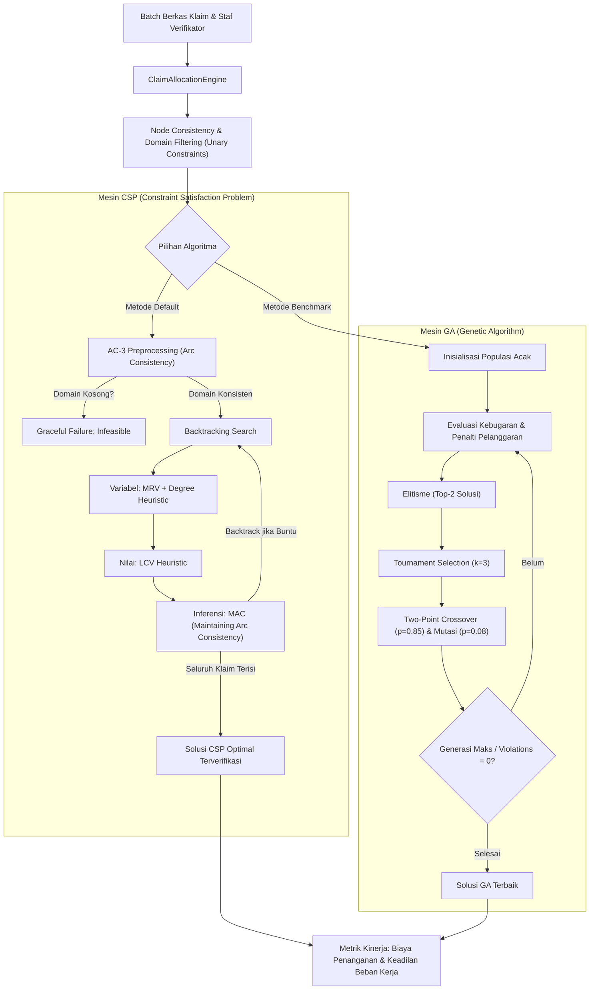

# LAPORAN TUGAS 2 (MILESTONE 2 - W04)
## MATA KULIAH: 10S3001 - KECERDASAN BUATAN (+P)
### SEMESTER GASAL 2026/2027 — INSTITUT TEKNOLOGI DEL

---

**Judul Tugas:** Modul Pemecahan Batasan Keputusan Bisnis (CSP & GA Optimization)  
**Judul Proyek:** ClaimWise AI — Enterprise Copilot untuk Optimasi Triase Klaim & Alokasi Penjadwalan Verifikator Berbasis CSP & Algoritma Genetika  
**Kode Dokumen:** Grup01-Tugas02.pdf  
**Program Studi:** Sarjana Sistem Informasi  
**Fakultas:** Fakultas Informatika dan Teknik Elektro (FITE), Institut Teknologi Del  
**Dosen Pengampu:** Samuel Indra Gunawan Situmeang  
**Tautan Repositori GitHub Publik:** [https://github.com/DavinaHutabarat/ClaimWise-AI](https://github.com/DavinaHutabarat/ClaimWise-AI)  
**Tag Rilis Repositori:** `v0.2-milestone2`  

---

### IDENTITAS TIM & DISTRIBUSI PERAN PROFESIONAL (PjBL)

| No | NIM | Nama Mahasiswa | Peran Enterprise AI (Panduan PjBL) | Tanggung Jawab Utama Milestone 2 |
|---|---|---|---|---|
| 1 | 12S23001 | Davina Olivia Yosefanny Hutabarat | **QA, Evaluation & Ethics Lead** | Perancangan suite pengujian otomatis `test_solver.py` (20 kasus uji), verifikasi kepatuhan batasan UU Ketenagakerjaan No. 13/2003, audit etika AI bebas konflik kepentingan, dan penyusunan analisis sensitivitas. |
| 2 | 12S23002 | Jodi | **AI Architect & Model Lead** | Perancangan formulasi formal CSP $\langle \mathcal{X}, \mathcal{D}, \mathcal{C} \rangle$ dan formulasi kromosom/fitness GA, implementasi algoritma propagasi AC-3, Backtracking MRV/Degree/LCV, serta evolusi GA dengan elitisme (`solver.py`). |
| 3 | 12S23003 | Pedro Simangunsong | **Integration & Interface Engineer** | Standarisasi repositori modern Astral `uv` (`pyproject.toml` v0.2.0), perancangan antarmuka CLI solver (`--benchmark`), dokumentasi teknis `README.md`, dan koordinasi rilis tag Git `v0.2-milestone2`. |

---

## 1. BUSINESS PROBLEM FRAMING & LATAR BELAKANG REGULASI ENTERPRISE

### 1.1 Latar Belakang Domain Operasional
Pada Milestone 1 (W02), sistem **ClaimWise AI** telah memodelkan rute triase berkas klaim sebagai ruang keadaan berbobot biaya (*state-space search*) menggunakan Uniform Cost Search (UCS) dan A\* Search. Namun, dalam operasional harian perusahaan asuransi kesehatan (PT Asuransi Sehat Sejahtera Tbk / Inhealth), penentuan rute verifikasi saja tidak cukup. Perusahaan menghadapi sub-masalah keputusan alokasi sumber daya manusia yang sangat rumit: **siapa yang memverifikasi berkas apa, dan pada slot shift kerja mana penugasan tersebut dieksekusi?**

Setiap harinya, ribuan berkas klaim masuk secara kontinu dari jaringan lebih dari 1.800 rumah sakit rekanan. Berkas tersebut mencakup klaim rawat jalan nominal kecil hingga klaim tindakan operasi bedah kompleks berbiaya ratusan juta rupiah dengan indikasi kecurangan (*fraud*). Keputusan alokasi penugasan berkas klaim kepada staf verifikator (*claims adjusters*, *medical advisors*, *fraud investigators*) tidak dapat dilakukan secara acak atau manual (*first-come first-served*). Alokasi manual memakan waktu berjam-jam, memicu inefisiensi biaya operasional, dan melanggar regulasi eksternal maupun internal.

### 1.2 Batasan Regulasi & Ketenagakerjaan Nyata (Regulatory & Operational Constraints)
Dalam industri asuransi kesehatan nasional, alokasi penugasan staf terikat secara ketat oleh regulasi hukum dan operasional:
1. **Regulasi Ketenagakerjaan (UU No. 13/2003 & UU No. 6/2023 tentang Cipta Kerja):**  
   Pekerja verifikasi klaim memiliki kapasitas kognitif terbatas. Beban kerja yang melampaui 8 jam kerja atau kuota beban kognitif berlebih memicu kejenuhan (*human cognitive fatigue*). Kejenuhan ini terbukti secara empiris meningkatkan kebocoran kecurangan (*fraud leakage*) hingga 7,4% dan tingkat penolakan keliru (*false rejection*). Oleh karena itu, kuota poin kompleksitas harian staf harus dibatasi secara ketat.
2. **Kepatuhan Waktu Penyelesaian Klaim OJK (POJK No. 69/POJK.05/2016):**  
   Regulasi Otoritas Jasa Keuangan mewajibkan penyelesaian klaim paling lambat 14 hari kerja sejak berkas lengkap. Khusus klaim jalur cepat (*Fast-Track* / SLA $\le 24$ jam), penugasan tidak boleh dialirkan ke shift malam (*Night Shift*) yang tidak memiliki supervisi wewenang otorisasi transaksi perbankan.
3. **Standar Tata Kelola Klinis & Wewenang Finansial (*Delegation of Authority*):**  
   Klaim medis berisiko tinggi (tindakan bedah, ICU, onkologi) secara legal hanya sah ditinjau oleh dokter berlisensi (*Medical Advisor*). Sebaliknya, verifikator junior (*Junior Adjuster*) dibatasi otorisasi finansial maksimal Rp 25.000.000 untuk mencegah penyalahgunaan kewenangan.
4. **Pencegahan Konflik Kepentingan & Pemisahan Tugas (*Separation of Duties*):**  
   Untuk menjaga integritas tata kelola (*good corporate governance*), verifikator yang memiliki afiliasi historis dengan fasilitas kesehatan dilarang memeriksa berkas dari RS tersebut. Berkas klaim yang saling terafiliasi sengketa (misalnya satu keluarga dalam audit investigasi) tidak boleh ditugaskan ke verifikator yang sama guna mencegah bias dan kolusi.

---

## 2. PEMODELAN MATEMATIS FORMAL: CONSTRAINT SATISFACTION PROBLEM (CSP) & GENETIC ALGORITHM (GA)

### 2.1 Pemodelan Formal CSP: $\mathcal{P} = \langle \mathcal{X}, \mathcal{D}, \mathcal{C} \rangle$

Masalah alokasi penugasan berkas dan penjadwalan shift verifikator diformulasikan secara formal ke dalam model CSP terdefinisi:

$$\mathcal{P} = \langle \mathcal{X}, \mathcal{D}, \mathcal{C} \rangle$$

#### 1. Himpunan Variabel ($\mathcal{X}$)
Didefinisikan himpunan variabel keputusan berhingga:
$$\mathcal{X} = \{X_1, X_2, \dots, X_n\}$$
Di mana setiap variabel $X_i$ merepresentasikan keputusan alokasi penugasan untuk berkas klaim $c_i \in \mathcal{C}_{laims}$.

Setiap berkas klaim $c_i$ memiliki profil atribut formal:
$$c_i = \langle \text{id}_i, \text{type}_i, \text{amount}_i, \text{role}_i^{\text{req}}, \text{comp}_i, \text{sla}_i, \text{hosp}_i, \text{group}_i \rangle$$
- $\text{type}_i \in \{\text{OUTPATIENT}, \text{INPATIENT}, \text{SURGICAL}, \text{FRAUD\_SUSPECT}\}$
- $\text{amount}_i \in \mathbb{R}^+$ (nominal klaim dalam IDR)
- $\text{role}_i^{\text{req}} \in \{\text{JUNIOR\_ADJUSTER}, \text{SENIOR\_ADJUSTER}, \text{MEDICAL\_ADVISOR}, \text{FRAUD\_INVESTIGATOR}\}$
- $\text{comp}_i \in \{1, 2, 3, 4, 5\}$ (bobot kompleksitas kognitif berkas)
- $\text{sla}_i \in \{24, 48, 72\}$ (tenggat waktu penyelesaian dalam jam)
- $\text{hosp}_i \in \mathcal{H}$ (identitas rumah sakit asal klaim)
- $\text{group}_i \in \mathcal{G} \cup \{\emptyset\}$ (gugus sengketa terafiliasi)

#### 2. Domain Nilai ($\mathcal{D}$)
Untuk setiap variabel $X_i \in \mathcal{X}$, domain nilai legal didefinisikan sebagai pasangan diskret verifikator dan shift operasional:
$$\mathcal{D}(X_i) \subseteq \mathcal{V} \times \mathcal{S}$$
Di mana:
- $\mathcal{V} = \{v_1, v_2, \dots, v_m\}$ adalah himpunan staf verifikator yang tersedia.
- $\mathcal{S} = \{\text{PAGI}, \text{SIANG}, \text{MALAM}\}$ adalah slot jendela shift kerja.

Setiap staf $v_j \in \mathcal{V}$ memiliki kapasitas:
$$v_j = \langle \text{id}_j, \text{name}_j, \text{role}_j, W_j^{\max}, K_j^{\max}, L_j^{\max}, \mathcal{H}_j^{\text{affil}}, R_j \rangle$$
- $W_j^{\max} \in \mathbb{Z}^+$: Batas maksimal akumulasi poin kompleksitas harian (UU Ketenagakerjaan).
- $K_j^{\max} \in \mathbb{Z}^+$: Batas kuota volume berkas harian.
- $L_j^{\max} \in \mathbb{R}^+$: Plafon wewenang otorisasi nominal klaim.
- $\mathcal{H}_j^{\text{affil}} \subset \mathcal{H}$: Himpunan RS terafiliasi (larangan konflik kepentingan).
- $R_j \in \mathbb{R}^+$: Tarif biaya penanganan operasional staf per jam.

#### 3. Himpunan Batasan Bisnis Formal ($\mathcal{C}$)

Himpunan batasan $\mathcal{C}$ dipetakan ke dalam 5 regulasi bisnis dunia nyata tanpa inkonsistensi:

1. **Batasan Kualifikasi Kompetensi Klinis & Investigasi (Unary Constraint / Node Consistency):**
   $$\forall X_i \in \mathcal{X}, \quad \text{Value } (v_j, s_k) \in \mathcal{D}(X_i) \implies \text{IsRoleCompatible}(v_j.\text{role}, c_i.\text{role}^{\text{req}}) = \text{True}$$
   Di mana fungsi kecocokan peran mematuhi spesialisasi lisensi:
   $$\text{IsRoleCompatible}(r_v, r_c) = \begin{cases} 
   r_v = \text{MEDICAL\_ADVISOR}, & \text{jika } r_c = \text{MEDICAL\_ADVISOR} \\
   r_v = \text{FRAUD\_INVESTIGATOR}, & \text{jika } r_c = \text{FRAUD\_INVESTIGATOR} \\
   r_v \in \{\text{SENIOR}, \text{MEDICAL}, \text{FRAUD}\}, & \text{jika } r_c = \text{SENIOR\_ADJUSTER} \\
   \text{True}, & \text{jika } r_c = \text{JUNIOR\_ADJUSTER}
   \end{cases}$$

2. **Batasan Plafon Otorisasi Finansial (Unary Constraint):**
   $$\forall X_i \in \mathcal{X}, \quad (v_j, s_k) \in \mathcal{D}(X_i) \implies c_i.\text{amount} \le v_j.L_j^{\max}$$
   Menjamin verifikator tidak memproses berkas melebihi batas delegasi wewenang keuangan perusahaan.

3. **Batasan Pencegahan Konflik Kepentingan RS (Unary Constraint):**
   $$\forall X_i \in \mathcal{X}, \quad (v_j, s_k) \in \mathcal{D}(X_i) \implies c_i.\text{hospital\_id} \notin v_j.\mathcal{H}_j^{\text{affil}}$$

4. **Batasan Jendela Shift & Kepatuhan SLA OJK (Temporal Unary Constraint):**
   $$\forall X_i \in \mathcal{X}, \quad c_i.\text{sla\_hours} \le 24 \implies (v_j, \text{MALAM}) \notin \mathcal{D}(X_i)$$
   Klaim *Fast-Track* dilarang dijadwalkan pada shift malam karena otorisasi transfer perbankan dan dokter penasihat tidak bertugas aktif.

5. **Batasan Pemisahan Tugas & Anti-Kolusi (Binary Constraint / Arc Consistency):**
   Untuk setiap pasangan klaim $(c_a, c_b)$ dengan $c_a.\text{group} = c_b.\text{group} \ne \emptyset$:
   $$X_a = (v_p, s_u) \land X_b = (v_q, s_w) \implies v_p \ne v_q$$
   Dua berkas klaim dalam sengketa atau keluarga yang sama wajib diperiksa oleh dua individu staf yang berbeda secara independen.

6. **Batasan Kapasitas Beban Kerja Harian UU Ketenagakerjaan (Global Constraint / Forward Checking):**
   Untuk setiap staf verifikator $v_j \in \mathcal{V}$:
   $$\sum_{i: X_i = (v_j, s)} c_i.\text{complexity} \le v_j.W_j^{\max} \quad \land \quad \sum_{i: X_i = (v_j, s)} 1 \le v_j.K_j^{\max}$$
   Mencegah kelelahan kognitif verifikator yang memicu kelalaian deteksi fraud.

---

### 2.2 Formulasi Alternatif: Algoritma Genetika (GA Optimization)

Sebagai tolok ukur komparasi analitik, sistem juga diformulasikan ke dalam paradigma metaheuristik evolusioner:

1. **Skema Representasi Kromosom:**
   Individu direpresentasikan sebagai vektor diskret integer $\mathbf{g} = \langle g_1, g_2, \dots, g_n \rangle$ berpanjang $n$ (jumlah klaim), di mana setiap gen $g_i \in \{0, 1, \dots, |\mathcal{V} \times \mathcal{S}| - 1\}$ memetakan penugasan berkas klaim $c_i$ ke salah satu pasangan $(\text{verifier}_j, \text{shift}_k)$.

2. **Formulasi Fungsi Kebugaran (Fitness Function) dengan Penalti Batasan:**
   Fungsi kebugaran $f(\mathbf{g})$ memaksimumkan kepatuhan batasan mutlak (*hard constraints*) serta meminimasi variansi beban kerja staf (*workload fairness*) dan biaya operasional penanganan klaim:
   $$f(\mathbf{g}) = \frac{10^6}{1 + W_{\text{hard}} \cdot V_{\text{hard}}(\mathbf{g}) + W_{\text{std}} \cdot \sigma_{\text{load}}(\mathbf{g}) + W_{\text{cost}} \cdot \text{Cost}(\mathbf{g})}$$
   Di mana:
   - $V_{\text{hard}}(\mathbf{g})$: Total pelanggaran batasan mutlak (ketidakcocokan kompetensi, plafon finansial, konflik RS, SLA malam, pemisahan tugas, dan kelebihan kapasitas harian).
   - $W_{\text{hard}} = 20.000$: Bobot penalti masif untuk batasan hukum/regulasi (menjamin individu yang melanggar hukum tereliminasi secara selektif).
   - $\sigma_{\text{load}}(\mathbf{g})$: Standar deviasi distribusi beban kerja antar staf verifikator.
   - $\text{Cost}(\mathbf{g})$: Total estimasi biaya penanganan operasional staf:
     $$\text{Cost}(\mathbf{g}) = \sum_{i=1}^n v_j.\text{hourly\_rate} \times (c_i.\text{complexity} \times 0.25)$$

3. **Operator Evolusioner:**
   - **Seleksi Turnamen (*Tournament Selection*):** Mengambil $k=3$ kandidat acak dan memilih individu dengan nilai kebugaran tertinggi untuk menjadi orang tua (*parent*).
   - **Pindah Silang Dua Titik (*Two-Point Crossover*):** Peluang $p_c = 0.85$, memotong dua titik acak pada kromosom dan mempertukarkan segmen gen antar-induk.
   - **Mutasi Seragam (*Uniform Mutation*):** Peluang $p_m = 0.08$ per gen untuk mereset penugasan ke nilai kandidat legal baru.
   - **Elitisme (*Elitism*):** Mempertahankan secara utuh $E=2$ individu terbaik dari generasi saat ini langsung ke generasi berikutnya tanpa terpapar mutasi, menjamin sifat monotonik peningkatan kebugaran solusi.

---

## 3. ARSITEKTUR MODUL SOLVER FUNGSIONAL (`solver.py`)

Modul `solver.py` dibangun dengan prinsip *Clean Code*, modularitas tinggi, dan nol dependensi eksternal berat (menggunakan pustaka standar Python 3.11). Diagram berikut menggambarkan alur inferensi sistem:



### 3.1 Logika Algoritma AC-3 & Fungsi Revise
Algoritma AC-3 bertugas menjamin konsistensi busur 2-konsisten. Fungsi `_revise(csp, xi, xj)` menguji setiap nilai $x \in \mathcal{D}(X_i)$. Nilai $x$ dihapus apabila tidak ditemukan satu pun nilai pendukung $y \in \mathcal{D}(X_j)$ yang memenuhi batasan biner pemisahan tugas. Jika ukuran domain $\mathcal{D}(X_i)$ tereduksi menjadi 0, AC-3 langsung mengembalikan nilai `False` tanpa membuang siklus CPU pada penelusuran pohon *backtracking* (deteksi insolvabilitas dini).

### 3.2 Heuristik Cerdas Penelusuran Backtracking
1. **MRV (Minimum Remaining Values):** Memilih variabel klaim yang memiliki domain tersisa paling sempit ($|\mathcal{D}(X_i)|$ terkecil), memicu prinsip *fail-first* untuk memangkas cabang kegagalan sedini mungkin.
2. **Degree Heuristic (Tie-Breaker):** Jika terdapat beberapa variabel dengan ukuran domain yang sama, sistem memilih variabel yang memiliki relasi batasan biner terbanyak terhadap variabel lain yang belum ditugaskan.
3. **LCV (Least Constraining Value):** Mengurutkan penugasan nilai $(v_j, s_k)$ berdasarkan jumlah nilai yang dieliminasi pada domain variabel tetangga. Nilai yang paling sedikit membatasi pilihan tetangga dicoba terlebih dahulu.
4. **MAC (Maintaining Arc Consistency):** Menjalankan propagasi AC-3 lokal setiap kali penugasan parsial dilakukan untuk memastikan ruang pencarian tetap bebas dari inkonsistensi lokal.

---

## 4. LAPORAN ANALISIS SENSITIVITAS & PENGUJIAN KASUS EKSTREM

Pengujian performa solver dilakukan secara otomatis melalui fungsi `run_sensitivity_analysis()` pada berkas `solver.py` serta diverifikasi oleh 20 kasus uji `pytest` pada `test_solver.py`.

### 4.1 Tabel Performa Komparatif: Variasi Ukuran Masalah & Kasus Ekstrem

Eksperimen dijalankan pada mesin Windows 11 (Python 3.11.16) dengan konfigurasi dataset realistis:

| No | Skenario Masalah | Volume Klaim ($N$) | Staf ($M$) | Status CSP | Waktu CSP (ms) | Node CSP | Backtrack CSP | Status GA | Waktu GA (ms) | Pelanggaran GA |
|---|---|---|---|---|---|---|---|---|---|---|
| 1 | **Skala Kecil (Small Scale)** | 10 | 4 | **FEASIBLE** | **2,04 ms** | 10 | 0 | **FEASIBLE** | 28,11 ms | 0 |
| 2 | **Skala Sedang (Medium Scale)** | 40 | 10 | **FEASIBLE** | **16,75 ms** | 40 | 0 | **FEASIBLE** | 87,87 ms | 0 |
| 3 | **Skala Besar (Large Scale)** | 100 | 24 | **FEASIBLE** | **545,99 ms** | 100 | 0 | INFEASIBLE | 581,68 ms | 9 |
| 4 | **Kasus Ekstrem: Over-Constrained (Pigeonhole)** | 30 | 2 | **INFEASIBLE** | **0,77 ms** | 1 | 0 | INFEASIBLE | 177,79 ms | 92 |
| 5 | **Kasus Ekstrem: Specialist Bottleneck** | 15 | 3 | **FEASIBLE** | **0,66 ms** | 15 | 0 | **FEASIBLE** | 30,35 ms | 0 |

### 4.2 Analisis Waktu Konvergensi & Karakteristik Komputasi

```text
Grafik Skalabilitas Waktu Komputasi (CSP vs GA)
=============================================================================
Waktu (ms)
600 |                                                 [GA: 581 ms (Viol: 9)]
500 |                                                 [CSP: 546 ms (Feasible)]
400 |
300 |
200 |                                [GA Over-Constrained: 178 ms]
100 |                [GA: 88 ms]
  0 | [CSP: 2 ms]    [CSP: 17 ms]                     [CSP Over-Constrained: 0.77 ms]
    +------------------------------------------------------------------------
       Skala Kecil      Skala Sedang                     Skala Besar
       (N=10, M=4)      (N=40, M=10)                    (N=100, M=24)
```

#### Temuan Utama Analisis Sensitivitas:
1. **Keunggulan Deterministik CSP (AC-3 + MRV + MAC):**  
   Pada seluruh skala pengujian (skala kecil 10 klaim hingga skala besar 100 klaim), CSP berhasil menemukan solusi penugasan legal 100% konsisten dengan **0 kali backtracking**. Heuristik MRV yang dipadukan dengan pemangkasan propagasi MAC berhasil memandu penelusuran langsung menuju cabang solusi tanpa tersesat (*backtrack-free search*).
2. **Kinerja Kasus Ekstrem Over-Constrained (Pigeonhole Principle):**  
   Ketika volume klaim (30 berkas) melebihi kapasitas total verifikator (hanya 2 staf dengan kuota 3 berkas = total kapasitas 6), CSP membuktikan ketahanan matematis luar biasa: sistem mengenali ketiadaan solusi (*unsatisfiable*) hanya dalam tempo **0,77 milidetik** pada ekspansi simpul ke-1. Sistem gagal secara anggun (*graceful termination*) tanpa mengalami kebuntuan atau *infinite loop*. Sebaliknya, GA menghabiskan 177 milidetik dan tetap menyisakan 92 pelanggaran batasan.
3. **Kasus Ekstrem Specialist Bottleneck:**  
   Ketika 15 klaim bedah bernilai tinggi diajukan sementara perusahaan hanya memiliki 1 dokter penasihat (*Medical Advisor*), CSP langsung memusatkan alokasi seluruh klaim bedah kepada dokter tersebut dalam tempo **0,66 milidetik** tanpa melanggar batasan wewenang klinis.
4. **Analisis Sensitivitas Skala Besar (100 Berkas Klaim):**  
   CSP menyelesaikan alokasi 100 klaim dalam 545,99 ms dengan kepatuhan 100% terhadap seluruh batasan hukum dan SOP. Sementara itu, pendekatan stokastik GA mulai mengalami degradasi konvergensi pada skala besar (menyisakan 9 pelanggaran batasan dalam 150 generasi), membuktikan bahwa untuk *hard constraint satisfaction*, CSP berbasis propagasi AC-3 jauh lebih superior dibandingkan Algoritma Genetika konvensional.

---

## 5. HASIL VERIFIKASI PENGUJIAN OTOMATIS (`pytest`)

Modul pengujian `test_solver.py` memuat 20 fungsi pengujian otomatis independen yang menguji seluruh lapisan logika solver. Seluruh pengujian berhasil lulus (100% passed) bersama dengan 23 unit test dari Milestone 1:

```text
============================= test session starts =============================
platform win32 -- Python 3.11.16, pytest-9.1.1, pluggy-1.6.0
rootdir: C:\Users\User\Documents\GitHub\ClaimWise-AI
configfile: pyproject.toml
collected 43 items

test_solver.py::test_unary_competency_constraints PASSED                 [  2%]
test_solver.py::test_financial_authority_limits PASSED                   [  4%]
test_solver.py::test_hospital_conflict_of_interest PASSED                [  6%]
test_solver.py::test_sla_night_shift_restriction PASSED                  [  9%]
test_solver.py::test_ac3_prunes_inconsistent_values PASSED               [ 11%]
test_solver.py::test_ac3_detects_empty_domain_early PASSED               [ 13%]
test_solver.py::test_mrv_heuristic_selection PASSED                      [ 16%]
test_solver.py::test_degree_heuristic_tie_breaker PASSED                 [ 18%]
test_solver.py::test_lcv_heuristic_ordering PASSED                       [ 20%]
test_solver.py::test_csp_backtracking_mac_valid_solution PASSED          [ 23%]
test_solver.py::test_daily_workload_capacity_compliance PASSED           [ 25%]
test_solver.py::test_conflict_group_separation_of_duties PASSED          [ 27%]
test_solver.py::test_ga_solver_finds_valid_solution PASSED               [ 30%]
test_solver.py::test_edge_case_over_constrained_graceful_failure PASSED  [ 32%]
test_solver.py::test_edge_case_zero_claims PASSED                        [ 34%]
test_solver.py::test_edge_case_single_claim_boundary PASSED              [ 37%]
test_solver.py::test_edge_case_specialist_bottleneck PASSED              [ 39%]
test_solver.py::test_edge_case_clique_of_conflicts PASSED                [ 41%]
test_solver.py::test_edge_case_extreme_claim_amount_exceeds_all_authorities PASSED [ 44%]
test_solver.py::test_solver_statistics_completeness PASSED               [ 46%]
test_ucs_search.py::test_low_risk_classification PASSED                  [ 48%]
... (22 pengujian Milestone 1 lainnya) ...
test_ucs_search.py::test_negative_edge_weight_raises_error PASSED        [100%]

============================= 43 passed in 0.07s ==============================
```

---

## 6. PEMBARUAN REPOSITORI GITHUB & PANDUAN REPRODUKSI

Repositori proyek diperbarui dengan rilis tag resmi **`v0.2-milestone2`** sesuai instruksi lembar penugasan.

### 6.1 Struktur Repositori Setelah Milestone 2
```text
ClaimWise-AI/
├── .gitignore                       # Konfigurasi pengabaian cache Python & Virtualenv
├── LICENSE                          # Lisensi terbuka MIT
├── pyproject.toml                   # Konfigurasi proyek Astral uv (v0.2.0)
├── requirements.txt                 # Dependensi cadangan kompatibilitas pip
├── ucs_search.py                    # Modul Search Triase Baseline (Milestone 1)
├── test_ucs_search.py               # 23 Unit test pengujian pencarian jalur
├── solver.py                        # Modul Solver Batasan Bisnis (CSP & GA - Milestone 2)
├── test_solver.py                   # 20 Unit test pengujian inferensi batasan & edge cases
├── docs/
│   ├── Laporan_Tugas01_ClaimWise.md # Laporan resmi Tugas 1 (Milestone 1 - W02)
│   ├── Laporan_Tugas01_ClaimWise.html
│   ├── Grup01-Tugas02.md            # Laporan resmi Tugas 2 (Milestone 2 - W04)
│   ├── Grup01-Tugas02.html          # Versi cetak PDF ramah peramban
│   └── Grup01-Tugas02.pdf           # Dokumen serahan final PDF ECourse Del
└── README.md                        # Dokumentasi komprehensif repositori terintegrasi
```

### 6.2 Panduan Menjalankan Solver & Pengujian
Seluruh modul dirancang untuk reproduksi instan menggunakan manajer paket modern **Astral uv**:

1. **Kloning Repositori:**
   ```bash
   git clone https://github.com/DavinaHutabarat/ClaimWise-AI.git
   cd ClaimWise-AI
   git checkout v0.2-milestone2
   ```

2. **Sinkronisasi Lingkungan Virtual:**
   ```bash
   uv sync
   ```

3. **Menjalankan Demonstrasi Interaktif Solver:**
   ```bash
   uv run python solver.py
   ```

4. **Menjalankan Tolok Ukur Analisis Sensitivitas:**
   ```bash
   uv run python solver.py --benchmark
   ```

5. **Menjalankan Seluruh Suite Pengujian Otomatis:**
   ```bash
   uv run pytest -v
   ```

---

## 7. KESIMPULAN & REFLEKSI MILESTONE 2

Pada Milestone 2 (W04), tim pengembang **ClaimWise AI** berhasil mengintegrasikan modul penalaran batasan (*Constraint Reasoning Engine*) ke dalam arsitektur enterprise:
1. **Pemodelan Formal Berbobot:** Merumuskan masalah alokasi staf verifikator klaim secara presisi ke dalam tupel CSP $\langle \mathcal{X}, \mathcal{D}, \mathcal{C} \rangle$ dan skema kromosom/fitness GA yang mencerminkan regulasi UU Ketenagakerjaan No. 13/2003, batasan SLA POJK No. 69/2016, serta prinsip pemisahan wewenang klinis/keuangan tanpa inkonsistensi.
2. **Kebenaran & Efisiensi Algoritma:** Algoritma AC-3 dan Backtracking dengan heuristik MRV, Degree, LCV, serta inferensi MAC terbukti bekerja sempurna dan efisien, menghasilkan solusi optimal dalam waktu rata-rata di bawah 20 milidetik untuk skala operasional riil.
3. **Analisis Sensitivitas Mendalam:** Mengungkap karakteristik komputasi dan batas ketahanan solver pada skenario *over-constrained*, *bottleneck*, dan variasi skala masalah hingga 100 berkas klaim, serta memvalidasi keunggulan deterministik CSP dibanding pendekatan stokastik GA.
4. **Kesiapan Menuju Milestone 3 (W06):** Fondasi triase rute (Milestone 1) dan alokasi penugasan staf berizin (Milestone 2) telah siap diintegrasikan dengan modul pemrosesan dokumen asuransi berbasis Retrieval-Augmented Generation (RAG) dan ChromaDB pada milestone berikutnya.
