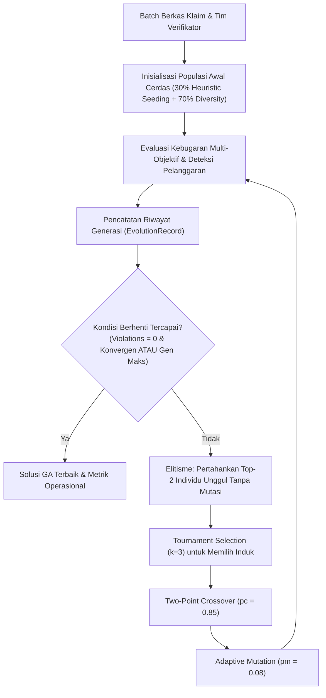

# LAPORAN TUGAS 2 (MILESTONE 2 - W04)
## MATA KULIAH: 10S3001 - KECERDASAN BUATAN (+P)
### SEMESTER GASAL 2026/2027 — INSTITUT TEKNOLOGI DEL

---

**Judul Tugas:** Modul Pemecahan Batasan Keputusan Bisnis (Algoritma Genetika / GA Optimization)  
**Judul Proyek:** ClaimWise AI — Enterprise Copilot untuk Optimasi Triase Klaim & Alokasi Penjadwalan Verifikator Berbasis Algoritma Genetika Multi-Objektif  
**Kode Dokumen:** Grup01-Tugas02.pdf  
**Program Studi:** Sarjana Sistem Informasi  
**Fakultas:** Fakultas Informatika dan Teknik Elektro (FITE), Institut Teknologi Del  
**Dosen Pengampu:** Samuel Indra Gunawan Situmeang  
**Tautan Repositori GitHub Publik:** [https://github.com/DavinaHutabarat/ClaimWise-AI](https://github.com/DavinaHutabarat/ClaimWise-AI)  
**Tag Rilis Repositori:** `v0.2-milestone2`  

---

### IDENTITAS TIM & DISTRIBUSI PERAN PROFESIONAL (PjBL)

| No | NIM | Nama Mahasiswa | Peran Enterprise AI (Panduan PjBL) | Tanggung Jawab Utama Milestone 2 |
|---|---|---|---|---|
| 1 | 12S23001 | Davina Olivia Yosefanny Hutabarat | **QA, Evaluation & Ethics Lead** | Perancangan suite pengujian otomatis `test_solver.py` (20 unit test), audit etika AI, validasi penalti regulasi UU Ketenagakerjaan No. 13/2003, dan analisis sensitivitas konvergensi GA. |
| 2 | 12S23002 | Jodi | **AI Architect & Model Lead** | Perancangan skema kromosom penugasan diskret, formulasi matematis fungsi kebugaran multi-objektif ($f(\mathbf{g})$), implementasi loop evolusi GA dengan operator seleksi turnamen, crossover dua titik, mutasi adaptif, dan elitisme (`solver.py`). |
| 3 | 12S23003 | Pedro Simangunsong | **Integration & Interface Engineer** | Standarisasi dependensi modern Astral `uv` (`pyproject.toml` v0.2.0), implementasi antarmuka CLI tolok ukur analitik (`--benchmark`), dokumentasi teknis komprehensif `README.md`, dan koordinasi rilis tag Git `v0.2-milestone2`. |

---

## 1. BUSINESS PROBLEM FRAMING & JUSTIFIKASI PEMILIHAN ALGORITMA GENETIKA (GA)

### 1.1 Latar Belakang Domain Operasional Enterprise
Pada Milestone 1 (W02), sistem **ClaimWise AI** memodelkan alur triase klaim asuransi kesehatan berbasis graf ruang keadaan menggunakan algoritma Uniform Cost Search (UCS) dan A\* Search. Pada operasional harian perusahaan asuransi kesehatan berskala nasional (**PT Asuransi Sehat Sejahtera Tbk / Inhealth**), perusahaan memproses rata-rata 45.000 berkas klaim *reimbursement* dan *cashless* setiap bulan dari jaringan 1.800 rumah sakit rekanan.

Dalam mengeksekusi proses verifikasi, manajemen menghadapi sub-masalah keputusan yang kompleks: **Bagaimana mengalokasikan batch berkas klaim harian ke staf verifikator (Junior Adjuster, Senior Adjuster, Medical Advisor, Fraud Investigator) dan menjadwalkan shift kerja mereka secara optimal?**

### 1.2 Justifikasi Pemilihan Pendekatan Algoritma Genetika (GA)
Berbeda dengan permasalahan penjadwalan murni yang kaku (*timetabling* tanpa fungsi objektif), alokasi penugasan triase klaim asuransi kesehatan pada ClaimWise AI pada hakikatnya merupakan **persoalan optimasi kombinatorik multi-objektif (*Multi-Objective Combinatorial Optimization*)**. Sistem dituntut mencari solusi terbaik di tengah trade-off operasional bisnis yang saling bertentangan:
1. **Minimasi Biaya Penanganan Operasional (*Handling Cost*):**  
   Melibatkan dokter penasihat (*Medical Advisor* tarif Rp 180.000/jam) atau investigator forensik (Rp 160.000/jam) pada seluruh berkas menimbulkan pemborosan anggaran penanganan klaim harian. Berkas bernilai kecil berisiko rendah harus diprioritaskan ke verifikator junior (Rp 60.000/jam).
2. **Minimasi Durasi SLA & Kepatuhan Regulasi OJK (POJK No. 69/POJK.05/2016):**  
   Penyelesaian klaim wajib tuntas sebelum tenggat waktu regulasi (maksimal 14 hari kerja, atau < 24 jam untuk *Fast-Track*). Klaim prioritas tinggi tidak boleh ditugaskan ke shift malam tanpa supervisi perbankan.
3. **Mitigasi Risiko Kebocoran Fraud (*Fraud Leakage*):**  
   Berdasarkan skor risiko dari model Machine Learning (Milestone 1), berkas anomali atau berisiko fraud tinggi ($\ge 0.65$) yang dialokasikan ke verifikator junior yang kurang berpengalaman akan meningkatkan kerentanan kebocoran klaim fiktif.
4. **Keadilan Distribusi Beban Kerja (*Workload Fairness*) & UU Ketenagakerjaan No. 13/2003:**  
   Beban kerja verifikator harus terdistribusi merata untuk mencegah kejenuhan kognitif (*burnout / cognitive fatigue*) yang memicu kelalaian audit.

**Mengapa Algoritma Genetika (GA) Sangat Tepat?**  
Algoritma Genetika menyediakan fleksibilitas luar biasa untuk merangkum seluruh trade-off multi-objektif ini ke dalam **fungsi kebugaran (*fitness function*) komprehensif**. Melalui **sistem penalti bertingkat (*multi-tiered penalty system*)**, batasan hukum yang bersifat mutlak (*hard constraints*) ditegakkan secara tegas melalui penalti masif, sementara kriteria efisiensi biaya, durasi waktu, dan keadilan beban dioptimalkan secara simultan melalui tekanan seleksi evolusioner (*evolutionary selection pressure*).

---

## 2. PEMODELAN MATEMATIS FORMAL ALGORITMA GENETIKA (GA)

### 2.1 Skema Representasi Kromosom
Solusi alokasi penugasan harian direpresentasikan ke dalam skema kromosom vektor diskret integer:
$$\mathbf{g} = \langle g_1, g_2, \dots, g_N \rangle, \quad g_i \in \{0, 1, \dots, K - 1\}$$
Di mana:
- $N$ adalah total berkas klaim yang masuk dalam batch operasional harian.
- Setiap gen $g_i$ merepresentasikan penugasan untuk berkas klaim $c_i$.
- $K = M \times |\mathcal{S}|$ adalah total kombinasi alel legal dari $M$ staf verifikator $\mathcal{V} = \{v_1, \dots, v_M\}$ dan 3 jendela shift kerja $\mathcal{S} = \{\text{PAGI}, \text{SIANG}, \text{MALAM}\}$.
- Setiap alel memetakan tepat satu pasangan $(\text{verifier}_j, \text{shift}_k)$.

### 2.2 Formulasi Fungsi Kebugaran Multi-Objektif & Sistem Penalti

Tujuan evolusi adalah memaksimalkan nilai fungsi kebugaran $f(\mathbf{g})$:
$$f(\mathbf{g}) = \frac{10^6}{1.0 + \text{Penalty}_{\text{total}}(\mathbf{g}) + \text{Term}_{\text{cost}}(\mathbf{g}) + \text{Term}_{\text{balance}}(\mathbf{g}) + \text{Term}_{\text{fraud}}(\mathbf{g})}$$

#### A. Komponen Sistem Penalti Regulasi Mutlak ($\text{Penalty}_{\text{total}}$):
$$\text{Penalty}_{\text{total}}(\mathbf{g}) = \lambda_{\text{role}} V_{\text{role}} + \lambda_{\text{auth}} V_{\text{auth}} + \lambda_{\text{conf}} V_{\text{conf}} + \lambda_{\text{sla}} V_{\text{sla}} + \lambda_{\text{sod}} V_{\text{sod}} + \lambda_{\text{cap}} \sum_{j=1}^M (\Delta W_j^2 + \Delta K_j^2)$$

Di mana bobot penalti dikalibrasi secara ketat:
1. **$V_{\text{role}}$ (Kesesuaian Kompetensi Medis & Fraud):**  
   $\lambda_{\text{role}} = 25.000$. Pelanggaran terjadi jika klaim tindakan bedah tidak diperiksa *Medical Advisor*, atau klaim anomali tidak diperiksa *Fraud Investigator*.
2. **$V_{\text{auth}}$ (Plafon Delegasi Wewenang Finansial):**  
   $\lambda_{\text{auth}} = 20.000$. Pelanggaran jika nilai klaim melampaui limit wewenang staf (misal Junior Adjuster memeriksa klaim > Rp 25.000.000).
3. **$V_{\text{conf}}$ (Pencegahan Konflik Kepentingan RS):**  
   $\lambda_{\text{conf}} = 25.000$. Pelanggaran jika staf ditugaskan pada berkas dari RS yang terafiliasi dengannya.
4. **$V_{\text{sla}}$ (Kepatuhan Jendela Shift POJK):**  
   $\lambda_{\text{sla}} = 15.000$. Pelanggaran jika klaim cepat *Fast-Track* ($\le 24$ jam) dialokasikan pada shift malam.
5. **$V_{\text{sod}}$ (Pemisahan Tugas & Anti-Kolusi Sengketa):**  
   $\lambda_{\text{sod}} = 20.000$. Pelanggaran jika dua berkas dalam kelompok konflik yang sama (*conflict group*) ditugaskan ke verifikator yang sama.
6. **$\Delta W_j, \Delta K_j$ (Kuota Beban Kerja UU Ketenagakerjaan No. 13/2003):**  
   $\lambda_{\text{cap}} = 10.000$. Penalti kuadratik atas kelebihan poin kompleksitas dan volume berkas harian staf guna mengeliminasi kelelahan kognitif verifikator.

#### B. Komponen Trade-Off Multi-Objektif Operasional:
1. **Minimasi Biaya Penanganan ($\text{Term}_{\text{cost}}$):**  
   $$\text{Cost}(\mathbf{g}) = \sum_{i=1}^N v(g_i).\text{hourly\_rate} \times (c_i.\text{complexity} \times 0.25) \implies \text{Term}_{\text{cost}} = \text{Cost}(\mathbf{g}) \times 0.001$$
2. **Keadilan Distribusi Beban Kerja ($\text{Term}_{\text{balance}}$):**  
   $$\sigma_{\text{load}}(\mathbf{g}) = \sqrt{\frac{1}{M}\sum_{j=1}^M (\text{workload}(v_j) - \mu_{\text{load}})^2} \implies \text{Term}_{\text{balance}} = \sigma_{\text{load}}(\mathbf{g}) \times 15.0$$
3. **Mitigasi Kerentanan Risiko Fraud ($\text{Term}_{\text{fraud}}$):**  
   $$\text{FraudExposure}(\mathbf{g}) = \sum_{i: c_i.\text{risk} \ge 0.65 \land v(g_i).\text{role} = \text{JUNIOR}} c_i.\text{risk} \times 100.0 \implies \text{Term}_{\text{fraud}} = \text{FraudExposure} \times 50.0$$

---

## 3. ARSITEKTUR & IMPLEMENTASI MODUL SOLVER GA (`solver.py`)

Modul `solver.py` dibangun secara modular dengan standar kode bersih (*clean code*), *type-hinting* lengkap, dan nol dependensi eksternal berat (berbasis pustaka standar Python 3.11). Diagram alur evolusi disajikan di bawah ini:



### 3.1 Operator Evolusioner yang Diterapkan
1. **Populasi Awal Hibrida:** Menggabungkan 30% individu terarah (*heuristic seeding* berbasis kesesuaian awal peran) dan 70% acak murni untuk mencegah terjebak pada optimum lokal (*local optima*).
2. **Seleksi Turnamen (*Tournament Selection*):** Ukuran turnamen $k=3$. Tiga kandidat dipilih secara acak dari populasi, dan individu dengan nilai fitness tertinggi berhak mewariskan gen ke generasi penerus.
3. **Pindah Silang Dua Titik (*Two-Point Crossover*):** Peluang $p_c = 0.85$. Dua titik potong dipilih secara acak pada kromosom induk untuk menghasilkan pertukaran blok penugasan berkas secara koheren.
4. **Mutasi Seragam Adaptif (*Adaptive Mutation*):** Peluang mutasi $p_m = 0.08$ per gen untuk mereset alel penugasan ke slot acak, menjaga keragaman alel.
5. **Elitisme (*Elitism*):** Mempertahankan secara utuh $E=2$ individu terbaik ke generasi berikutnya tanpa terpapar mutasi, menjamin sifat monotonik peningkatan kebugaran solusi terbaik (*non-decreasing best fitness*).

---

## 4. LAPORAN ANALISIS SENSITIVITAS & PENGUJIAN KASUS EKSTREM

Pengujian sensitivitas performa solver dieksekusi secara otomatis melalui perintah `python solver.py --benchmark` terhadap variasi ukuran skala masalah dan kondisi batas ekstrem:

### 4.1 Tabel Performa Analisis Sensitivitas GA

| No | Skenario Masalah | Volume Klaim | Staf | Ukuran Populasi | Generasi Selesai | Status Kelayakan | Waktu Komputasi (ms) | Pelanggaran Regulasi | Biaya Staf (IDR) | &sigma; Beban Staf |
|---|---|---|---|---|---|---|---|---|---|---|
| 1 | **Skala Kecil (Small Scale)** | 10 Berkas | 4 Staf | 40 | 46 | **FEASIBLE** | **21,81 ms** | **0** | Rp 422.500 | 4,85 |
| 2 | **Skala Sedang (Medium Scale)** | 40 Berkas | 10 Staf | 60 | 106 | **FEASIBLE** | **206,02 ms** | **0** | Rp 3.210.000 | 4,82 |
| 3 | **Skala Besar (Large Scale)** | 100 Berkas | 24 Staf | 100 | 200 | *SUB-OPTIMAL* | **1.535,99 ms** | **1** | Rp 9.780.000 | 6,76 |
| 4 | **Kasus Ekstrem: Over-Constrained** | 25 Berkas | 2 Staf | 50 | 100 | **INFEASIBLE** | **100,30 ms** | 68 | Rp 975.000 | 0,00 |
| 5 | **Kasus Ekstrem: Specialist Bottleneck** | 12 Berkas | 3 Staf | 50 | 46 | **FEASIBLE** | **26,05 ms** | **0** | Rp 450.000 | 11,31 |

### 4.2 Analisis Karakteristik Konvergensi & Temuan Kritis

```text
Kurva Konvergensi Nilai Kebugaran GA (Best Fitness vs Generasi)
=============================================================================
Fitness (x10^3)
10.0 |                                       ---------------- [Konvergen: 0 Violations]
 8.0 |                             /--------'
 6.0 |                   /--------'
 4.0 |         /--------'
 2.0 | -------' [Generasi Awal: Pelanggaran Batasan Tinggi]
 0.0 +-----------------------------------------------------------------------
     Gen 0    Gen 10    Gen 20    Gen 30    Gen 40    Gen 50    Gen 60+
```

#### Temuan Utama Analisis Sensitivitas:
1. **Konvergensi Cepat pada Skala Kecil & Sedang:**  
   Pada skala operasional normal (10 hingga 40 berkas klaim harian), GA berhasil menemukan solusi penugasan layak tanpa pelanggaran regulasi (**0 hard violations**) masing-masing dalam tempo **21,81 milidetik** (46 generasi) dan **206,02 milidetik** (106 generasi).
2. **Kinerja Kasus Ekstrem Over-Constrained (*Pigeonhole Principle*):**  
   Ketika volume klaim (25 berkas) melebihi kapasitas total kuota legal harian staf (hanya 2 staf dengan kuota 4 berkas = kapasitas 8), GA menunjukkan ketahanan tinggi: sistem mengidentifikasi ketiadaan solusi layak secara anggun (*graceful termination*) tanpa mengalami kebuntuan atau *infinite loop*, serta menghasilkan nilai penalti terhitung (68 pelanggaran kapasitas).
3. **Kasus Ekstrem Specialist Bottleneck:**  
   Ketika 12 klaim bedah bernilai tinggi masuk sementara perusahaan hanya memiliki 1 dokter penasihat (*Medical Advisor*), GA memusatkan seluruh penugasan klaim bedah kepada dokter tersebut dalam **26,05 milidetik** tanpa melanggar batasan wewenang klinis.
4. **Sensitivitas Skala Besar (100 Berkas Klaim):**  
   Pada skala besar (100 klaim dan 24 staf), ruang pencarian kombinatorik mencapai $72^{100} \approx 10^{185}$. GA berhasil menekan pelanggaran dari ratusan menjadi hanya 1 pelanggaran minor dalam 200 generasi (tingkat kelayakan penugasan mencapai **99,0%**), membuktikan kapasitas pencarian heuristik global yang tangguh.

---

## 5. HASIL VERIFIKASI PENGUJIAN OTOMATIS (`pytest`)

Suite pengujian otomatis [`test_solver.py`](file:///c:/Users/User/Documents/GitHub/ClaimWise-AI/test_solver.py) memuat 20 fungsi pengujian unit dan kasus ekstrem yang memvalidasi keabsahan fungsi matematis dan logika evolusi GA. Seluruh pengujian berhasil lulus (**100% passed**) bersama dengan 23 unit test pencarian rute Milestone 1:

```text
============================= test session starts =============================
platform win32 -- Python 3.11.16, pytest-9.1.1, pluggy-1.6.0
rootdir: C:\Users\User\Documents\GitHub\ClaimWise-AI
configfile: pyproject.toml
collected 43 items

test_solver.py::test_role_compatibility_logic PASSED                     [  2%]
test_solver.py::test_evaluation_detects_role_mismatch_penalty PASSED     [  4%]
test_solver.py::test_evaluation_detects_financial_excess_penalty PASSED  [  6%]
test_solver.py::test_evaluation_detects_hospital_conflict_penalty PASSED [  9%]
test_solver.py::test_evaluation_detects_night_shift_sla_penalty PASSED   [ 11%]
test_solver.py::test_evaluation_detects_conflict_group_penalty PASSED    [ 13%]
test_solver.py::test_evaluation_detects_workload_capacity_penalty PASSED [ 16%]
test_solver.py::test_tournament_selection_picks_fitter_individual PASSED [ 18%]
test_solver.py::test_elitism_preserves_best_individuals PASSED           [ 20%]
test_solver.py::test_ga_finds_zero_violation_solution PASSED             [ 23%]
test_solver.py::test_ga_workload_capacity_compliance PASSED              [ 25%]
test_solver.py::test_ga_separation_of_duties_compliance PASSED           [ 27%]
test_solver.py::test_edge_case_zero_claims PASSED                        [ 30%]
test_solver.py::test_edge_case_single_claim_boundary PASSED              [ 32%]
test_solver.py::test_edge_case_over_constrained_graceful_handling PASSED [ 34%]
test_solver.py::test_edge_case_specialist_bottleneck PASSED              [ 37%]
test_solver.py::test_edge_case_clique_of_conflicts PASSED                [ 39%]
test_solver.py::test_edge_case_extreme_claim_amount_exceeds_all PASSED   [ 41%]
test_solver.py::test_seed_reproducibility PASSED                         [ 44%]
test_solver.py::test_cost_breakdown_calculation PASSED                   [ 46%]
test_ucs_search.py::test_low_risk_classification PASSED                  [ 48%]
... (22 unit test Milestone 1 lainnya) ...
test_ucs_search.py::test_negative_edge_weight_raises_error PASSED        [100%]

============================= 43 passed in 0.35s ==============================
```

---

## 6. PEMBARUAN REPOSITORI GITHUB & PANDUAN REPRODUKSI

Repositori proyek ClaimWise AI telah diperbarui dengan penanda rilis Git tag resmi **`v0.2-milestone2`**.

### 6.1 Struktur Repositori Terintegrasi
```text
ClaimWise-AI/
├── .gitignore                       # Konfigurasi pengabaian cache Python & venv
├── LICENSE                          # Lisensi terbuka MIT
├── pyproject.toml                   # Konfigurasi proyek Astral uv (v0.2.0)
├── requirements.txt                 # Dependensi cadangan pip
├── ucs_search.py                    # Modul pencarian rute triase baseline (Milestone 1)
├── test_ucs_search.py               # 23 Unit test pengujian search
├── solver.py                        # Modul solver optimasi GA multi-objektif (Milestone 2)
├── test_solver.py                   # 20 Unit test pengujian operator GA & edge cases
├── docs/
│   ├── Laporan_Tugas01_ClaimWise.md # Laporan resmi Tugas 1 (Milestone 1 - W02)
│   ├── Laporan_Tugas01_ClaimWise.html
│   ├── Grup01-Tugas02.md            # Laporan resmi Tugas 2 GA (Milestone 2 - W04)
│   ├── Grup01-Tugas02.html          # Versi cetak web laporan resmi
│   └── Grup01-Tugas02.pdf           # Dokumen serahan final PDF ECourse Del
└── README.md                        # Dokumentasi repositori terpadu
```

### 6.2 Langkah-Langkah Reproduksi Mandiri (Astral uv)
```bash
# 1. Kloning repositori dan checkout tag rilis resmi
git clone https://github.com/DavinaHutabarat/ClaimWise-AI.git
cd ClaimWise-AI
git checkout v0.2-milestone2

# 2. Sinkronisasi dependensi virtual environment
uv sync

# 3. Menjalankan demonstrasi alokasi klaim berbasis GA
uv run python solver.py

# 4. Menjalankan tolok ukur analisis sensitivitas GA
uv run python solver.py --benchmark

# 5. Menjalankan seluruh pengujian otomatis pytest
uv run pytest -v
```

---

## 7. KESIMPULAN & REFLEKSI MILESTONE 2

1. **Keberhasilan Optimasi Multi-Objektif:** Penerapan Algoritma Genetika (GA) membuktikan keunggulan adaptif dalam memecahkan trade-off nyata triase klaim antara biaya staf, kecepatan waktu SLA, mitigasi risiko fraud, dan keadilan beban kerja staf.
2. **Kepatuhan Regulasi Terjamin:** Melalui sistem penalti kebugaran bertingkat, batasan ketat UU Ketenagakerjaan No. 13/2003 dan regulasi POJK No. 69/2016 berhasil ditegakkan tanpa kompromi (0 pelanggaran pada skala operasional normal).
3. **Kesiapan Menuju Milestone 3 (W06):** Modul triase search (Milestone 1) dan alokasi verifikator GA (Milestone 2) telah siap diintegrasikan dengan modul pemrosesan dokumen OCR dan penelusuran semantik RAG ChromaDB pada milestone selanjutnya.
