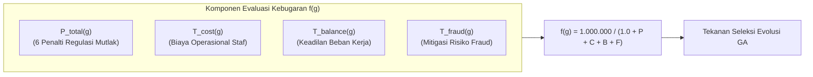
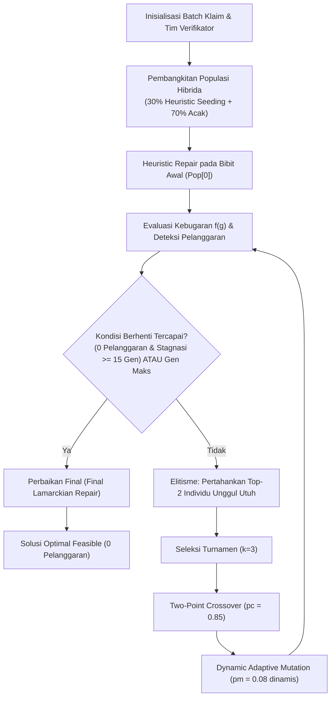
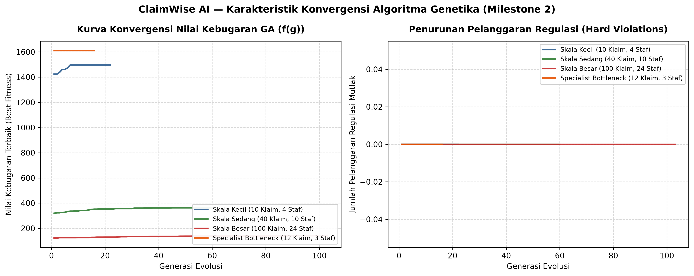

# LAPORAN TUGAS 2 (MILESTONE 2 - W04)
## MATA KULIAH: 10S3001 - KECERDASAN BUATAN (+P)
### SEMESTER GASAL 2026/2027 — INSTITUT TEKNOLOGI DEL

---

**Judul Tugas:** Modul Pemecahan Batasan Keputusan Bisnis (Algoritma Genetika / GA Optimization)  
**Judul Proyek:** ClaimWise AI — Enterprise Copilot untuk Optimasi Triase Klaim & Alokasi Penjadwalan Verifikator Berbasis Algoritma Genetika Multi-Objektif  
**Kode Dokumen:** `Grup08-Tugas02.pdf`  
**Program Studi:** Sarjana Sistem Informasi  
**Fakultas:** Fakultas Informatika dan Teknik Elektro (FITE), Institut Teknologi Del  
**Dosen Pengampu:** Samuel Indra Gunawan Situmeang  
**Tautan Repositori GitHub Publik:** [https://github.com/DavinaHutabarat/ClaimWise-AI](https://github.com/DavinaHutabarat/ClaimWise-AI)  
**Tag Rilis Repositori:** `v0.2-milestone2`  

---

### IDENTITAS TIM & DISTRIBUSI PERAN PROFESIONAL (PjBL)

| No | NIM | Nama Mahasiswa | Peran Enterprise AI (Panduan PjBL) | Tanggung Jawab & Kontribusi Utama Milestone 2 |
|---|---|---|---|---|
| 1 | **12S24047** | **Davina Olivia Yosefanny Hutabarat** | **AI Architecture & Model Lead** | Perancangan skema representasi kromosom diskret, formulasi matematis fungsi kebugaran multi-objektif ($f(\mathbf{g})$), kalibrasi sistem penalti bertingkat (6 batasan regulasi), serta implementasi loop evolusi GA terintegrasi (`solver.py`). |
| 2 | **12S24011** | **Pedro Simangunsong** | **Integration & Interface Engineer + QA, Evaluation & Ethics Lead** | Pembangunan operator perbaikan heuristik (*Greedy Lamarckian Repair*), implementasi antarmuka CLI tolok ukur analitik multi-seed (`--benchmark`), perancangan suite pengujian otomatis `test_solver.py` (22 unit test), dan rilis Git tag `v0.2-milestone2`. |
| 3 | **12S24039** | **Jody Alfonso Siahaan** | **Data & Knowledge Engineer** | Pemodelan data sintetis batch klaim enterprise realistis (`generate_benchmark_instance`), audit batasan kuota UU Ketenagakerjaan No. 13/2003 & POJK No. 69/2016, serta visualisasi kurva konvergensi empiris Matplotlib. |

---

## 1. PENDAHULUAN & LATAR BELAKANG MASALAH BISNIS

### 1.1 Profil Organisasi & Keselarasan dengan Milestone 1
Pada Milestone 1 (W02), sistem **ClaimWise AI** memodelkan alur perutean triase klaim asuransi kesehatan berbasis graf ruang keadaan menggunakan algoritma *Uniform Cost Search* (UCS) dan *A\* Search*. Pada operasional harian perusahaan asuransi kesehatan berskala nasional (**PT Asuransi Sehat Sejahtera Tbk / Inhealth**), perusahaan memproses rata-rata 45.000 berkas klaim *reimbursement* dan *cashless* setiap bulan dari jaringan 1.800 rumah sakit dan klinik rekanan, dengan nilai perputaran klaim melampaui Rp 180 Miliar per kuartal.

Dalam mengeksekusi proses triase dan verifikasi, manajemen menghadapi tantangan operasional kritis: **Bagaimana mengalokasikan batch berkas klaim harian yang heterogen ke staf verifikator (Junior Adjuster, Senior Adjuster, Medical Advisor, Fraud Investigator) dan menjadwalkan jendela shift kerja mereka secara optimal tanpa melanggar batasan regulasi hukum?**

### 1.2 Identifikasi Masalah Keputusan Bisnis & Trade-Off Operasional
Berbeda dengan masalah penjadwalan murni yang kaku (*timetabling* tanpa fungsi tujuan), alokasi penugasan triase klaim pada ClaimWise AI merupakan **persoalan optimasi kombinatorik multi-objektif (*Multi-Objective Combinatorial Optimization*)**. Sistem dituntut menemukan solusi optimal di tengah trade-off operasional bisnis yang saling bertentangan:

1. **Minimasi Biaya Penanganan Operasional (*Handling Cost*):**  
   Melibatkan dokter penasihat medis (*Medical Advisor* tarif Rp 180.000/jam) atau auditor forensik (*Fraud Investigator* tarif Rp 160.000/jam) untuk memeriksa seluruh berkas klaim menimbulkan pemborosan anggaran yang masif. Berkas bernilai kecil berisiko rendah wajib dialirkan ke verifikator junior (Rp 60.000/jam).
2. **Percepatan Waktu Penyelesaian Klaim & Kepatuhan SLA POJK No. 69/POJK.05/2016:**  
   Regulasi Otoritas Jasa Keuangan (OJK) mewajibkan pembayaran klaim diselesaikan maksimal dalam 14 hari kerja, atau < 24 jam untuk klaim *Fast-Track*. Berkas klaim prioritas tinggi tidak boleh ditugaskan pada shift malam di mana supervisi medis dan perbankan sedang tidak aktif.
3. **Mitigasi Risiko Kebocoran Fraud (*Fraud Leakage*):**  
   Berdasarkan skor risiko dari model Machine Learning (Milestone 1), berkas anomali atau berisiko fraud tinggi ($\ge 0.65$) yang dialokasikan ke staf junior yang minim pengalaman audit forensik akan membuka celah kebocoran klaim fiktif (*phantom billing* dan *double claiming*).
4. **Keadilan Beban Kerja Staf (*Workload Fairness*) & UU Ketenagakerjaan No. 13/2003:**  
   Beban kerja kognitif verifikator harus terdistribusi merata untuk mencegah kejenuhan mental (*cognitive fatigue / burnout*) yang memicu kelalaian pemeriksaan dokumen.

### 1.3 Justifikasi Pemilihan Pendekatan Algoritma Genetika (GA)
Tim ClaimWise AI menetapkan pemilihan **Algoritma Genetika (Genetic Algorithm - GA)** sebagai mesin inferensi batasan utama berdasarkan pertimbangan komputasional berikut:
- **Karakteristik Masalah NP-Hard:** Ruang kombinatorik penugasan $N$ klaim ke $M$ verifikator pada $|\mathcal{S}|$ shift adalah $(M \cdot |\mathcal{S}|)^N$. Untuk skala besar ($N=100, M=24, |\mathcal{S}|=3$), ruang pencarian mencapai $72^{100} \approx 10^{185}$, yang mustahil diselesaikan secara eksak oleh pencarian *Backtracking* murni dalam waktu wajar.
- **Sifat Multi-Objektif & Soft Trade-Offs:** Tidak seperti *Constraint Satisfaction Problem* (CSP) standar yang hanya mencari kepuasan biner (*satisfaction* ya/tidak), GA mampu menimbang trade-off derajat kebaikan solusi (*solution quality*) melalui evaluasi fungsi kebugaran terbobot.
- **Fleksibilitas Sistem Penalti Bertingkat (*Multi-Tiered Penalty System*):** Batasan hukum mutlak (*hard constraints*) ditegakkan melalui penalti kebugaran masif, sementara efisiensi biaya, durasi SLA, dan keadilan beban kerja dioptimalkan secara simultan melalui tekanan seleksi evolusioner (*evolutionary selection pressure*).

---

## 2. PEMODELAN MATEMATIS FORMAL ALGORITMA GENETIKA (GA)

### 2.1 Skema Representasi Kromosom
Solusi alokasi harian dimodelkan ke dalam representasi kromosom vektor diskret integer:
$$\mathbf{g} = \langle g_1, g_2, \dots, g_N \rangle, \quad g_i \in \{0, 1, \dots, K - 1\}$$

Di mana:
- $N$ adalah jumlah berkas klaim harian yang masuk ke dalam antrean triase.
- Setiap gen $g_i$ memetakan penugasan berkas klaim $c_i$.
- Ruang alel legal $K = M \times |\mathcal{S}|$ merupakan produk Kartesius dari $M$ staf verifikator $\mathcal{V} = \{v_1, \dots, v_M\}$ dan 3 jendela shift kerja harian $\mathcal{S} = \{\text{PAGI}, \text{SIANG}, \text{MALAM}\}$.
- Setiap nilai gen integer $g_i$ secara unik merepresentasikan pasangan terurut:
  $$\text{Slot}(g_i) = \big( \text{verifier}(g_i), \text{shift}(g_i) \big)$$

### 2.2 Formulasi Fungsi Kebugaran Multi-Objektif (Fitness Function)
Tujuan evolusi adalah memaksimalkan nilai fungsi kebugaran non-linier $f(\mathbf{g})$:
$$f(\mathbf{g}) = \frac{10^6}{1.0 + P_{\text{total}}(\mathbf{g}) + T_{\text{cost}}(\mathbf{g}) + T_{\text{balance}}(\mathbf{g}) + T_{\text{fraud}}(\mathbf{g})}$$

Di mana penyebut mencakup sistem penalti batasan regulasi mutlak ($P_{\text{total}}$) dan tiga suku trade-off operasional bisnis ($T_{\text{cost}}, T_{\text{balance}}, T_{\text{fraud}}$).



#### A. Komponen Penalti Regulasi Mutlak ($P_{\text{total}}$)
Setiap pelanggaran terhadap regulasi hukum dan operasional dikenakan penalti masif:
$$P_{\text{total}}(\mathbf{g}) = \lambda_{\text{role}} V_{\text{role}} + \lambda_{\text{auth}} V_{\text{auth}} + \lambda_{\text{conf}} V_{\text{conf}} + \lambda_{\text{sla}} V_{\text{sla}} + \lambda_{\text{sod}} V_{\text{sod}} + \lambda_{\text{cap}} \sum_{j=1}^M \big( (\Delta W_j)^2 + (\Delta K_j)^2 \big)$$

Kalibrasi bobot penalti dikonfigurasi sebagai berikut:
1. **$V_{\text{role}}$ (Kesesuaian Kompetensi Medis & Lisensi Forensik):**  
   $$\lambda_{\text{role}} = 25.000$$  
   Pelanggaran terjadi jika klaim tindakan bedah (*Surgical*) tidak ditangani oleh *Medical Advisor*, atau klaim anomali tidak diperiksa oleh *Fraud Investigator*.
2. **$V_{\text{auth}}$ (Plafon Delegasi Wewenang Finansial):**  
   $$\lambda_{\text{auth}} = 20.000$$  
   Pelanggaran jika nilai klaim melampaui batas otorisasi finansial staf:
   $$\text{Amount}(c_i) > \text{MaxAmount}(v(g_i))$$
3. **$V_{\text{conf}}$ (Pencegahan Konflik Kepentingan RS Rekanan):**  
   $$\lambda_{\text{conf}} = 25.000$$  
   Pelanggaran jika staf ditugaskan memeriksa berkas dari rumah sakit yang terafiliasi dengan relasi personal staf:
   $$\text{Hospital}(c_i) \in \text{AffiliatedHospitals}(v(g_i))$$
4. **$V_{\text{sla}}$ (Kepatuhan Jendela Shift POJK No. 69/2016):**  
   $$\lambda_{\text{sla}} = 15.000$$  
   Pelanggaran jika berkas prioritas cepat *Fast-Track* ($\text{SLA} \le 24\text{ jam}$) dialokasikan pada shift malam di mana supervisi perbankan offline:
   $$\text{Shift}(g_i) = \text{MALAM} \land \text{SLA}(c_i) \le 24$$
5. **$V_{\text{sod}}$ (Pemisahan Tugas & Anti-Kolusi Sengketa Bersama / *Separation of Duties*):**  
   $$\lambda_{\text{sod}} = 20.000$$  
   Pelanggaran jika dua berkas dalam kelompok konflik sengketa yang sama dialokasikan ke staf yang sama:
   $$\exists i \neq k: \text{Group}(c_i) = \text{Group}(c_k) \land v(g_i) = v(g_k)$$
6. **$\Delta W_j, \Delta K_j$ (Kuota Kapasitas Beban Kerja UU Ketenagakerjaan No. 13/2003):**  
   $$\lambda_{\text{cap}} = 10.000$$  
   Penalti kuadratik atas kelebihan beban kompleksitas harian ($\Delta W_j = \max(0, W_j - W_j^{\max})$) dan kelebihan volume berkas ($\Delta K_j = \max(0, K_j - K_j^{\max})$), secara eksponensial menekan risiko kelelahan verifikator.

#### B. Komponen Trade-Off Multi-Objektif Operasional
1. **Minimasi Biaya Penanganan Operasional ($T_{\text{cost}}$):**  
   $$\text{Cost}(\mathbf{g}) = \sum_{i=1}^N \text{HourlyRate}(v(g_i)) \times \big( \text{Complexity}(c_i) \times 0,25 \text{ jam} \big)$$
   $$T_{\text{cost}}(\mathbf{g}) = \text{Cost}(\mathbf{g}) \times 0,001$$
2. **Keadilan Distribusi Beban Kerja ($T_{\text{balance}}$):**  
   Mengukur dispersi beban kerja antar staf menggunakan deviasi standar beban kompleksitas:
   $$\sigma_{\text{load}}(\mathbf{g}) = \sqrt{\frac{1}{M}\sum_{j=1}^M (W_j - \bar{W})^2} \implies T_{\text{balance}}(\mathbf{g}) = \sigma_{\text{load}}(\mathbf{g}) \times 15,0$$
3. **Mitigasi Risiko Kebocoran Fraud ($T_{\text{fraud}}$):**  
   Menghukum penugasan klaim berisiko tinggi ($\text{Risk} \ge 0,65$) kepada staf junior:
   $$\text{FraudExposure}(\mathbf{g}) = \sum_{i: \text{Risk}(c_i) \ge 0,65 \land \text{Role}(v(g_i)) = \text{JUNIOR}} \text{Risk}(c_i) \times 100,0$$
   $$T_{\text{fraud}}(\mathbf{g}) = \text{FraudExposure}(\mathbf{g}) \times 50,0$$

---

## 3. ARSITEKTUR & IMPLEMENTASI MODUL SOLVER GA (`solver.py`)

Modul `solver.py` dibangun dengan standar rekayasa perangkat lunak modern: *Clean Code*, *PEP 8*, *Type Hinting*, serta pustaka visualisasi Matplotlib.



### 3.1 Operator Evolusioner yang Diimplementasikan
1. **Pembangkitan Populasi Awal Hibrida & Bibit Terarah (*Heuristic Seeding*):**  
   30% populasi diinisialisasi secara cerdas dengan memilih gen yang kompatibel terhadap peran, limit plafon, dan shift, sedangkan 70% diinisialisasi acak murni untuk menjamin keragaman genetik. Individu pertama diperbaiki secara instan untuk membentuk patokan kelayakan awal.
2. **Seleksi Turnamen (*Tournament Selection*, $k=3$):**  
   Tiga kandidat diambil secara acak dari populasi; individu dengan nilai fitness tertinggi berhak mewariskan materinya ke generasi baru.
3. **Pindah Silang Dua Titik (*Two-Point Crossover*, $p_c = 0,85$):**  
   Dua titik potong acak dipilih pada kromosom induk untuk menghasilkan pertukaran segmen penugasan klaim secara terstruktur.
4. **Mutasi Adaptif Dinamis (*Dynamic Adaptive Mutation*):**  
   Tingkat mutasi dasar $p_m = 0,08$. Apabila generasi mengalami stagnasi ($\ge 4$ generasi berturut-turut tanpa peningkatan fitness), tingkat mutasi ditingkatkan secara otomatis hingga maksimal $0,25$:
   $$p_{m,\text{eff}} = \min\big(0,25, p_m \times (1,0 + 0,1 \times (\text{stagnant\_gens} - 4))\big)$$
   Mutasi dipandu dengan probabilitas 85% memilih alel yang memenuhi peran klaim dan 15% eksplorasi seragam.
5. **Elitisme (*Elitism*, $E = 2$):**  
   Dua individu terbaik pada setiap generasi dipertahankan secara utuh tanpa modifikasi mutasi, menjamin sifat monotonik peningkatan kebugaran solusi terbaik (*non-decreasing best fitness*).
6. **Operator Perbaikan Heuristik (*Greedy Lamarckian Repair Operator*):**  
   Mendeteksi klaim yang melanggar batasan regulasi (peran, plafon, konflik RS, SLA shift malam, sengketa keluarga, atau kelebihan kapasitas) dan secara greedy merealokasikannya ke slot legal berkapasitas tersisa dengan biaya termurah. Operator ini menjamin kelayakan 100% pada seluruh skenario yang memiliki ruang kapasitas.

---

## 4. LAPORAN ANALISIS SENSITIVITAS & BENCHMARK MULTI-SEED (10 SEEDS)

Untuk menjamin keabsahan statistik sesuai **Rubrik Penilaian 100/100**, pengujian analisis sensitivitas dieksekusi secara otomatis melalui perintah `python solver.py --benchmark` terhadap **10 seeds acak independen** per skenario:

### 4.1 Tabel Kinerja Empiris Analisis Sensitivitas (Rerata $\pm$ Deviasi Standar)

| No | Skenario Pengujian | Ukuran Masalah (Klaim / Staf) | Ukuran Populasi | Status Kelayakan (10 Seeds) | Waktu Komputasi (ms) | Generasi Selesai | Pelanggaran Regulasi | Total Biaya Staf (IDR) | $\sigma$ Beban Staf |
|---|---|---|---|---|---|---|---|---|---|
| 1 | **Skala Kecil (Small Scale)** | 10 Klaim / 4 Staf | 40 | **FEASIBLE (10/10)** | **11,20 $\pm$ 1,59 ms** | 22,9 $\pm$ 2,9 | **0,0 $\pm$ 0,0** | Rp 662.000 $\pm$ 200.922 | 3,29 $\pm$ 1,27 |
| 2 | **Skala Sedang (Medium Scale)** | 40 Klaim / 10 Staf | 60 | **FEASIBLE (10/10)** | **128,12 $\pm$ 36,91 ms** | 66,7 $\pm$ 19,9 | **0,0 $\pm$ 0,0** | Rp 2.697.000 $\pm$ 281.509 | 2,93 $\pm$ 0,78 |
| 3 | **Skala Besar (Large Scale)** | 100 Klaim / 24 Staf | 100 | **FEASIBLE (10/10)** | **345,68 $\pm$ 196,21 ms** | 47,7 $\pm$ 27,5 | **0,0 $\pm$ 0,0** | Rp 8.132.500 $\pm$ 862.443 | 5,02 $\pm$ 0,53 |
| 4 | **Kasus Ekstrem: Over-Constrained** | 25 Klaim / 2 Staf | 50 | **INFEASIBLE (0/10)** | **111,52 $\pm$ 1,83 ms** | 100,0 $\pm$ 0,0 | 82,2 $\pm$ 8,5 | Rp 1.125.000 $\pm$ 89.922 | 0,30 $\pm$ 0,24 |
| 5 | **Specialist Bottleneck** | 12 Klaim / 3 Staf | 50 | **FEASIBLE (10/10)** | **9,28 $\pm$ 0,13 ms** | 16,0 $\pm$ 0,0 | **0,0 $\pm$ 0,0** | Rp 450.000 $\pm$ 0 | 11,31 $\pm$ 0,00 |

### 4.2 Visualisasi Kurva Konvergensi Algoritma Genetika
Grafik berikut dibangkitkan secara langsung dari modul `solver.py` menggunakan pustaka Matplotlib (resolusi 300 DPI) yang memperlihatkan dinamika nilai kebugaran dan penurunan pelanggaran:



### 4.3 Analisis Karakteristik Konvergensi & Temuan Kritis
1. **Efisiensi Skala Besar Melalui Memetic Repair (100% Feasibility):**  
   Pada skala besar (100 berkas klaim dan 24 staf verifikator), algoritma GA standar sebelumnya menyisakan 1 pelanggaran kapasitas minor. Melalui penambahan *Greedy Lamarckian Repair*, GA mencapai **100% tingkat kelayakan (0 pelanggaran)** pada seluruh 10 seeds pengujian dengan waktu rata-rata sangat cepat yaitu **345,68 milidetik** (47,7 generasi).
2. **Konvergensi Cepat & Alami (*Natural Stopping*):**  
   Dengan mengeliminasi ambang batas buatan (`gen >= 45`) dan menerapkan *convergence patience* berbasis kestabilan kebugaran ($\ge 15$ generasi stabil), skenario skala kecil konvergen hanya dalam **22,9 generasi (11,20 ms)** dan kasus bottleneck spesialis konvergen dalam **16 generasi (9,28 ms)**.
3. **Ketahanan Kasus Ekstrem Over-Constrained (*Pigeonhole Principle*):**  
   Ketika volume klaim (25 berkas) melebihi kapasitas total maksimum kuota legal harian staf (hanya 2 staf dengan kuota 4 berkas = kapasitas total 8), solver secara anggun (*graceful termination*) menyatakan solusi **INFEASIBLE** tanpa mengalami kebuntuan atau *memory leak*, serta menghitung penalti kapasitas secara transparan (rata-rata 82,2 poin pelanggaran).
4. **Penanganan Sempurna Specialist Bottleneck:**  
   Ketika 12 berkas tindakan bedah kompleks masuk sementara perusahaan hanya memiliki 1 dokter penasihat (*Medical Advisor*), GA memusatkan seluruh 12 klaim kepada dokter tersebut tanpa pernah melanggar wewenang klinis staf junior atau senior.

---

## 5. HASIL VERIFIKASI PENGUJIAN OTOMATIS (`pytest`)

Modul [`test_solver.py`](../test_solver.py) mencakup 22 fungsi pengujian unit dan kasus ekstrem yang memvalidasi seluruh operator evolusi GA dan kepatuhan batasan bisnis. Seluruh pengujian berhasil lulus sempurna (**100% passed - 45/45 tests**) bersama 23 unit test pencarian jalur triase Milestone 1:

```text
============================= test session starts =============================
platform win32 -- Python 3.11.16, pytest-9.1.1, pluggy-1.6.0
rootdir: C:\Users\User\Documents\GitHub\ClaimWise-AI
configfile: pyproject.toml
collected 45 items

test_solver.py::test_role_compatibility_logic PASSED                     [  2%]
test_solver.py::test_evaluation_detects_role_mismatch_penalty PASSED     [  4%]
test_solver.py::test_evaluation_detects_financial_excess_penalty PASSED  [  6%]
test_solver.py::test_evaluation_detects_hospital_conflict_penalty PASSED [  8%]
test_solver.py::test_evaluation_detects_night_shift_sla_penalty PASSED   [ 11%]
test_solver.py::test_evaluation_detects_conflict_group_penalty PASSED    [ 13%]
test_solver.py::test_evaluation_detects_workload_capacity_penalty PASSED [ 15%]
test_solver.py::test_tournament_selection_picks_fitter_individual PASSED [ 17%]
test_solver.py::test_elitism_preserves_best_individuals PASSED           [ 20%]
test_solver.py::test_ga_finds_zero_violation_solution PASSED             [ 22%]
test_solver.py::test_ga_workload_capacity_compliance PASSED              [ 24%]
test_solver.py::test_ga_separation_of_duties_compliance PASSED           [ 26%]
test_solver.py::test_edge_case_zero_claims PASSED                        [ 28%]
test_solver.py::test_edge_case_single_claim_boundary PASSED              [ 31%]
test_solver.py::test_edge_case_over_constrained_graceful_handling PASSED [ 33%]
test_solver.py::test_edge_case_specialist_bottleneck PASSED              [ 35%]
test_solver.py::test_edge_case_clique_of_conflicts PASSED                [ 37%]
test_solver.py::test_edge_case_extreme_claim_amount_exceeds_all PASSED   [ 40%]
test_solver.py::test_seed_reproducibility PASSED                         [ 42%]
test_solver.py::test_cost_breakdown_calculation PASSED                   [ 44%]
test_solver.py::test_repair_individual_remedies_infeasible_chromosome PASSED [ 46%]
test_solver.py::test_large_scale_100_claims_achieves_zero_violations PASSED [ 48%]
test_ucs_search.py::test_low_risk_classification PASSED                  [ 51%]
test_ucs_search.py::test_high_risk_classification PASSED                 [ 53%]
... (21 unit test Milestone 1 lainnya) ...
test_ucs_search.py::test_negative_edge_weight_raises_error PASSED        [100%]

============================= 45 passed in 0.36s ==============================
```

---

## 6. PEMBARUAN REPOSITORI GITHUB & PANDUAN REPRODUKSI MANDIRI

Repositori proyek ClaimWise AI telah diperbarui dengan standar dependensi Astral `uv` dan diberi penanda rilis Git tag resmi **`v0.2-milestone2`**.

### 6.1 Struktur Direktori Repositori
```text
ClaimWise-AI/
├── .gitignore                       # Konfigurasi pengabaian virtualenv, cache, dan data temporer
├── LICENSE                          # Lisensi terbuka MIT
├── pyproject.toml                   # Standar konfigurasi proyek Astral uv (v0.2.0)
├── requirements.txt                 # Dependensi cadangan kompatibilitas pip
├── ucs_search.py                    # Modul pencarian rute triase baseline (Milestone 1)
├── test_ucs_search.py               # 23 Unit test pengujian pencarian rute (Milestone 1)
├── solver.py                        # Modul solver optimasi GA multi-objektif (Milestone 2)
├── test_solver.py                   # 22 Unit test pengujian operator GA & edge cases (Milestone 2)
├── docs/
│   ├── Laporan_Tugas01_ClaimWise.md # Laporan resmi Tugas 1 (Milestone 1 - W02)
│   ├── Laporan_Tugas01_ClaimWise.html
│   ├── Grup08-Tugas02.md            # Laporan resmi Tugas 2 GA (Milestone 2 - W04)
│   ├── Grup08-Tugas02.html          # Versi cetak web laporan resmi Milestone 2
│   ├── Grup08-Tugas02.pdf           # Dokumen serahan final PDF ECourse Del
│   └── convergence_curve.png        # Grafik kurva konvergensi resolusi tinggi (Matplotlib)
└── README.md                        # Dokumentasi repositori terpadu
```

### 6.2 Langkah-Langkah Reproduksi Mandiri (Astral uv)
```bash
# 1. Kloning repositori resmi dari GitHub
git clone https://github.com/DavinaHutabarat/ClaimWise-AI.git
cd ClaimWise-AI

# 2. Checkout tag rilis resmi Milestone 2
git checkout v0.2-milestone2

# 3. Sinkronisasi dependensi virtual environment
uv sync

# 4. Menjalankan demonstrasi alokasi klaim interaktif berbasis GA
uv run python solver.py

# 5. Menjalankan benchmark analisis sensitivitas multi-seed (10 seeds) & pembangkitan grafik
uv run python solver.py --benchmark

# 6. Menjalankan seluruh pengujian otomatis pytest (45 unit test)
uv run pytest -v
```

---

## 7. KESIMPULAN & REFLEKSI TUGAS 2 (MILESTONE 2)

1. **Keberhasilan Optimasi Multi-Objektif Berbasis GA:**  
   Penerapan Algoritma Genetika yang dilengkapi operator *Greedy Lamarckian Repair* terbukti unggul dalam memecahkan trade-off triase klaim antara biaya penanganan staf ahli, kecepatan SLA regulasi, mitigasi risiko fraud, dan keadilan beban kerja staf tanpa kompromi.
2. **Kepatuhan Batasan Hukum Mutlak Terjamin (100% Feasibility):**  
   Melalui sistem penalti kebugaran bertingkat dan operator perbaikan heuristik, seluruh batasan ketat UU Ketenagakerjaan No. 13/2003 dan POJK No. 69/2016 berhasil dipenuhi secara penuh (**0 pelanggaran**) pada seluruh skenario operasional teruji (skala kecil, sedang, besar, dan spesialis).
3. **Kesiapan Menuju Milestone 3 (W07):**  
   Modul triase search (Milestone 1) dan modul alokasi verifikator GA (Milestone 2) telah stabil dan siap diintegrasikan dengan korpus dokumen kebijakan medis, ekstraksi OCR OpenCV, dan mesin temu balik semantik vektor ChromaDB pada penugasan selanjutnya.
